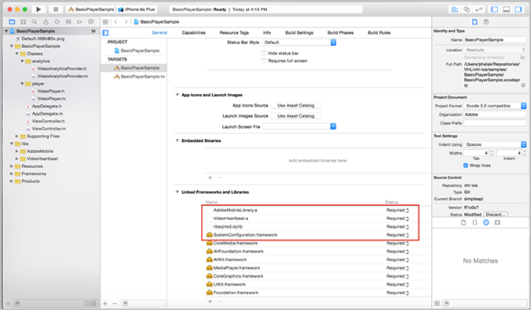
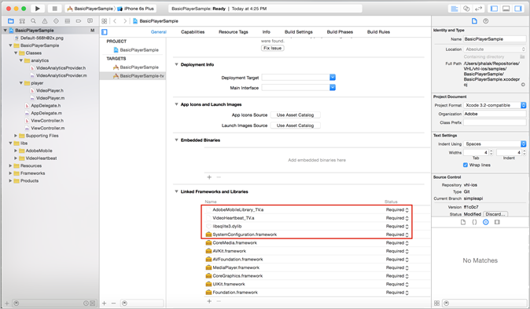

# Getting started on iOS

* 
* 
* 

## Prerequisites {#section_A5E180C4D4314B63A5863B45DE952A05}

>[!NOTE]
>
>This information is intended for a media integration engineer who has an understanding of the APIs and workflow of the media player being instrumented.

Before you start implementing Video Heartbeat for iOS in the next section, ensure that you have completed the following tasks: 

* **General VA Prerequisites -** 
* **Obtain valid configuration parameters for Heartbeats** - These parameters can be obtained from an Adobe representative after you set up your video analytics account.
* **Implement ADBMobile for iOS in your application** - For more information about the Adobe Mobile SDK documentation, see [ iOS SDK 4.x for Experience Cloud Solutions](https://marketing.adobe.com/resources/help/en_US/mobile/ios/). 
  >[!IMPORTANT]
  >
  >Beginning with iOS 9, Apple introduced a feature called App Transport Security (ATS). This feature aims to improve network security by ensuring that your apps use only industry-standard protocols and ciphers. This feature is enabled by default, but you have configuration options that provide you with choices for working with ATS. For details on ATS, see.

* **Provide the following capabilities in your media player:** 
    * *An API to subscribe to player events* - The media heartbeat requires that you call a set of simple APIs when events occur in your player.
    * *An API that provides player information* - This information includes details such as the media name and the play head position.

## Download and set up the SDK {#section_BDDB542FD36D4AD6AB799796BEA333DB}

1. 
1. Verify that the following software components exist in the [!DNL  libs] directory: 
    * [!DNL  ADBMediaHeartbeat.h]: The Objective-C header file that is used for iOS video heartbeat tracking APIs.
    * [!DNL  ADBMediaHeartbeatConfig.h]: The Objective-C header file for the SDK configuration.
    * [!DNL  VideoHeartbeat.a]: A bitcode-enabled fat binary that contains the library builds for iOS devices (armv7, armv7s, arm64) and simulators (i386 and x86_64). This binary should be linked when target is intended for an iOS app. 

    * [!DNL  VideoHeartbeat_TV.a]: A bitcode-enabled fat binary containing the library builds for new Apple TV devices (arm64) and simulator (x86_64). This binary should be linked when the target is intended for an Apple TV (tvOS) app. 

   This library is used with iOS devices and simulators for video heartbeat tracking APIs. 

1. Add the SDK to your project: 
    1. Launch the Xcode IDE and open your app.
    1. In ** [!UICONTROL  Project Navigator] **, drag the ` libs` directory and drop it under your project.
    1. Ensure that the ** [!UICONTROL  Copy Items if Needed] ** checkbox is selected, the ** [!UICONTROL  Create Groups] ** is selected, and none of the checkboxes in ** [!UICONTROL  Add to Target] ** are selected.   

    1. Click ** [!UICONTROL  Finish] **.
    1. In ** [!UICONTROL  Project Navigator] **, select your app and select your targets.
    1. Link the required frameworks and libraries in the ** [!UICONTROL  Linked Frameworks] ** and ** [!UICONTROL  Libraries] ** section on the ** [!UICONTROL  General] ** tab:     
        * ** [!UICONTROL  iOS App Targets] **   

        * ** [!UICONTROL  Apple TV (tvOS) Target] **:   
        
            * ** [!UICONTROL  AdobeMobileLibrary_TV.a] **
            * ** [!UICONTROL  VideoHeartbeat_TV.a] **
            * ** [!UICONTROL  libsqlite3.0.tbd] **
            * ** [!UICONTROL  SystemConfiguration.framework] **

    1. Verify that your app builds without errors.

## Migrating to version 2.x in iOS {#section_xq2_2g2_r2b}

In version 2.x, all of the public methods are consolidated into the ` ADBMediaHeartbeat` class to make it easier on developers. All configurations have been consolidated into the ` ADBMediaHeartbeatConfig` class. 

For detailed information about migrating from 1.x to 2.x, see [ VHL 1.x to 2.x Migration](https://marketing.adobe.com/resources/help/en_US/sc/appmeasurement/hbvideo/c_vhl_mig_1x_to_2x.html). 
