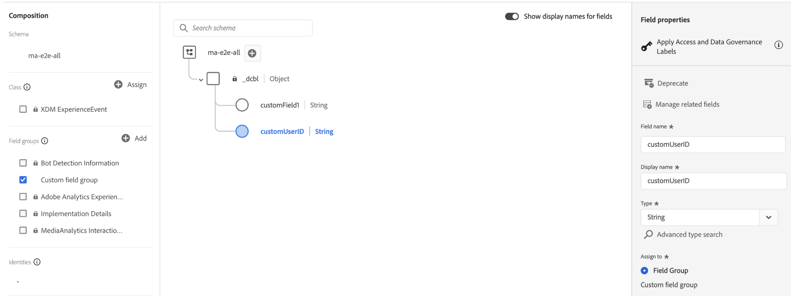

# Custom metadata support - XDM format

The Experience Edge API allows you to send media custom metadata alongside standard XDM fields in `sessionStart`, `adStart`, and `chapterStart` API events. Media custom metadata sent via the XDM format can be forwarded to both **Adobe Analytics** and **Adobe Experience Platform**.

For Media Collection API implementations, see [Custom metadata support](/help/implementation/media-collection-api/mc-api-impl/mc-api-custom-meta.md).

## Overview

Media custom metadata can be sent in two locations within an Experience Edge request, each with different routing behaviour:

| Location | Sent to Adobe Analytics | Sent to Adobe Experience Platform | Use Case |
|----------|------------------------|-----------------------------------|----------|
| `xdm.mediaCollection.customMetadata` | ✅ Yes | ✅ Yes | Business data needed in both systems |
| `_data` | ✅ Yes | ❌ No | Analytics-specific flags or processing hints |

Custom metadata applies to three event types:

| Event | Metadata Applies To |
|-------|-------------------|
| `sessionStart` | Main content (entire session) |
| `adStart` | Individual advertisement |
| `chapterStart` | Content chapter or segment |

## Structure

### `xdm.mediaCollection.customMetadata` (Analytics + AEP)

Custom metadata is an **array of name-value objects** inside the `mediaCollection` object:

```json
{
  "xdm": {
    "mediaCollection": {
      "customMetadata": [
        {
          "name": "_tenant.fieldName",
          "value": "fieldValue"
        }
      ]
    }
  }
}
```

<InlineAlert variant="warning" slots="text" />

`customMetadata` must be an **array** inside `mediaCollection`, not at the `xdm` root level.

**Incorrect:**

```json
{
  "xdm": {
    "eventType": "media.sessionStart",
    "customMetadata": [...]  // ❌ Wrong location
  }
}
```

**Correct:**

```json
{
  "xdm": {
    "eventType": "media.sessionStart",
    "mediaCollection": {
      "customMetadata": [...]  // ✅ Inside mediaCollection
    }
  }
}
```

### `_data` (Analytics only)

The `_data` object is a special Experience Edge construct that sends data exclusively to Adobe Analytics, bypassing AEP datasets. Custom metadata must be placed under `__adobe.analytics.contextData`.

Unlike `xdm.mediaCollection.customMetadata` which uses an **array of name-value objects**, the `_data` mapping uses a flat **key-value object** directly under `contextData`:

| Approach | Structure | Destination |
|----------|-----------|-------------|
| `xdm.mediaCollection.customMetadata` | Array of `{"name": "...", "value": "..."}` objects | Analytics + AEP |
| `_data.__adobe.analytics.contextData` | Flat key-value object `{"key": "value"}` | Analytics only |

```json
{
  "xdm": { ... },
  "_data": {
    "__adobe": {
      "analytics": {
        "contextData": {
          "debugMode": "true",
          "internalTestFlag": "QA-Session"
        }
      }
    }
  }
}
```

### Naming conventions

- **XDM format:** prefix with tenant namespace using an underscore. You can also create structures in your tenant custom field group such as `_<tenant>.<struct_name>.<field_name>`.
- **`_data` format:** fields are placed under `_data.__adobe.analytics.contextData` — no underscore prefix required on the field name (e.g., `debugFlag`)

## Main content custom metadata

Sent with `sessionStart`. Applies to the primary media being tracked and remains available throughout ad and chapter calls. Any custom metadata defined here will be automatically merged by the media backend on the corresponding close calls. It will be included alongside any specific custom metadata defined for ads and chapters.

<CodeBlock slots="heading, code" repeat="1" languages="CURL"/>

### Request

```sh
curl -X POST "https://edge.adobedc.net/ee/va/v1/sessionStart?configId={datastreamId}" \
--header 'Content-Type: application/json' \
--data '{
  "events": [
    {
      "xdm": {
        "eventType": "media.sessionStart",
        "mediaCollection": {
          "sessionDetails": {
            "name": "Sample Video",
            "playerName": "HTML5 Player",
            "contentType": "VOD",
            "length": 3600,
            "channel": "Sports"
          },
          "playhead": 0,
          "customMetadata": [
            {
              "name": "_mycompany.contentCategory",
              "value": "Live Sports"
            },
            {
              "name": "_mycompany.leagueType",
              "value": "Professional"
            }
          ]
        },
        "timestamp": "2026-03-10T18:00:00Z"
      }
    }
  ]
}'
```

## Ad custom metadata

Sent with `adStart`. Specific to each individual advertisement. The custom metadata from `sessionStart` is also automatically merged by the media backend on the ad close call alongside any ad-specific custom metadata defined here.

<CodeBlock slots="heading, code" repeat="1" languages="CURL"/>

### Request

```sh
curl -X POST "https://edge.adobedc.net/ee/va/v1/adStart?configId={datastreamId}" \
--header 'Content-Type: application/json' \
--data '{
  "events": [
    {
      "xdm": {
        "eventType": "media.adStart",
        "mediaCollection": {
          "sessionID": "your-session-id",
          "playhead": 30,
          "advertisingDetails": {
            "name": "Summer Sale Ad",
            "playerName": "HTML5 Player",
            "length": 30,
            "podPosition": 1
          },
          "customMetadata": [
            {
              "name": "_mycompany.campaignId",
              "value": "SUMMER2026"
            },
            {
              "name": "_mycompany.targetAudience",
              "value": "18-34"
            },
            {
              "name": "_mycompany.adFormat",
              "value": "skippable"
            }
          ]
        },
        "timestamp": "2026-03-10T18:05:30Z"
      }
    }
  ]
}'
```

## Chapter custom metadata

Sent with `chapterStart`. Specific to each content chapter or segment. The custom metadata from `sessionStart` is also automatically merged by the media backend on the chapter close call alongside any chapter-specific custom metadata defined here.

<CodeBlock slots="heading, code" repeat="1" languages="CURL"/>

### Request

```sh
curl -X POST "https://edge.adobedc.net/ee/va/v1/chapterStart?configId={datastreamId}" \
--header 'Content-Type: application/json' \
--data '{
  "events": [
    {
      "xdm": {
        "eventType": "media.chapterStart",
        "mediaCollection": {
          "sessionID": "your-session-id",
          "playhead": 600,
          "chapterDetails": {
            "friendlyName": "Introduction",
            "length": 300,
            "index": 1,
            "offset": 600
          },
          "customMetadata": [
            {
              "name": "_mycompany.chapterType",
              "value": "tutorial"
            },
            {
              "name": "_mycompany.difficulty",
              "value": "beginner"
            }
          ]
        },
        "timestamp": "2026-03-10T18:10:00Z"
      }
    }
  ]
}'
```

## Using the `_data` object (Analytics-only metadata)

Use the `_data` object when you need metadata in Adobe Analytics that should **not** be stored in AEP datasets — for example, temporary flags, debugging variables, or Analytics-specific processing hints.

<InlineAlert variant="warning" slots="text" />

Data sent via `_data` is not stored in Adobe Experience Platform and is not available for Real-Time CDP, Journey Orchestration, or other AEP services.

<CodeBlock slots="heading, code" repeat="1" languages="CURL"/>

### Request

```sh
curl -X POST "https://edge.adobedc.net/ee/va/v1/sessionStart?configId={datastreamId}" \
--header 'Content-Type: application/json' \
--data '{
  "events": [
    {
      "xdm": {
        "eventType": "media.sessionStart",
        "mediaCollection": {
          "sessionDetails": {
            "name": "Sample Video",
            "playerName": "HTML5 Player",
            "contentType": "VOD",
            "length": 3600
          },
          "playhead": 0,
          "customMetadata": [
            {
              "name": "_mycompany.league",
              "value": "Action"
            }
          ]
        },
        "timestamp": "2026-03-10T18:00:00Z"
      },
      "_data": {
        "__adobe": {
          "analytics": {
            "contextData": {
              "debugMode": "true",
              "testFlag": "QA-Session"
            }
          }
        }
      }
    }
  ]
}'
```

In this example:
- `_mycompany.league` → sent to both Analytics and AEP
- `debugMode` and `testFlag` (under `_data.__adobe.analytics.contextData`) → sent to Analytics only


## Downstream data location

<InlineAlert variant="info" slots="text" />

`xdm.mediaCollection.customMetadata` is the **inbound API path** used to send custom metadata with events. After processing, the data is forwarded to Adobe Analytics as context data variables and stored in Adobe Experience Platform under `mediaReporting.customMetadata` and as top-level flattened fields.

**Adobe Analytics:**
- After processing, custom metadata is forwarded to Adobe Analytics as context data variables. The `_tenant` prefix is automatically stripped, so processing rules reference only the field path after `_tenant` (e.g., `_mycompany.contentCategory` becomes `contentCategory`)
- Data sent via `_data` is also forwarded to Adobe Analytics and available via processing rules
- Use processing rules to map context data variables to eVars, props, or other Analytics variables. See [Data variable mapping for the Adobe Experience Platform Edge Network](https://experienceleague.adobe.com/en/docs/analytics/implementation/aep-edge/data-var-mapping) for details.

**Adobe Experience Platform:**
- Custom metadata fields must be defined as custom fields in your XDM schema (e.g., `_mycompany`) and they can be stored and queried in AEP as flattened fields

  
- For reporting and querying, custom metadata is available under `mediaReporting.customMetadata` and also as top-level flattened fields. Use whichever is most suitable for your use case.
- Accessible for segmentation, Journey Orchestration, and Real-Time CDP activation

## Behavior

- All custom metadata values must be **strings**. Convert numbers and booleans before sending.
- `sessionStart` metadata persists for the entire session; updates require a new session
- Each `adStart` and `chapterStart` event can carry different custom metadata
- Prefer standard XDM fields (`sessionDetails`, `advertisingDetails`, `chapterDetails`) over custom metadata when a standard field exists


## Related documentation

- [Custom metadata support](/help/implementation/media-collection-api/mc-api-impl/mc-api-custom-meta.md). — MC API (JSON format)
- [Media Collection Details data type](https://experienceleague.adobe.com/en/docs/experience-platform/xdm/data-types/media-collection-details) — XDM schema reference
- [Data variable mapping for the Adobe Experience Platform Edge Network](https://experienceleague.adobe.com/en/docs/analytics/implementation/aep-edge/data-var-mapping) — Analytics context data mapping for XDM fields
<!--
- [Session endpoints](sessions.md) — Session lifecycle management
- [Ad endpoints](ads.md) — Track advertising impressions
- [Chapter endpoints](chapters.md) — Segment content into chapters
-->
