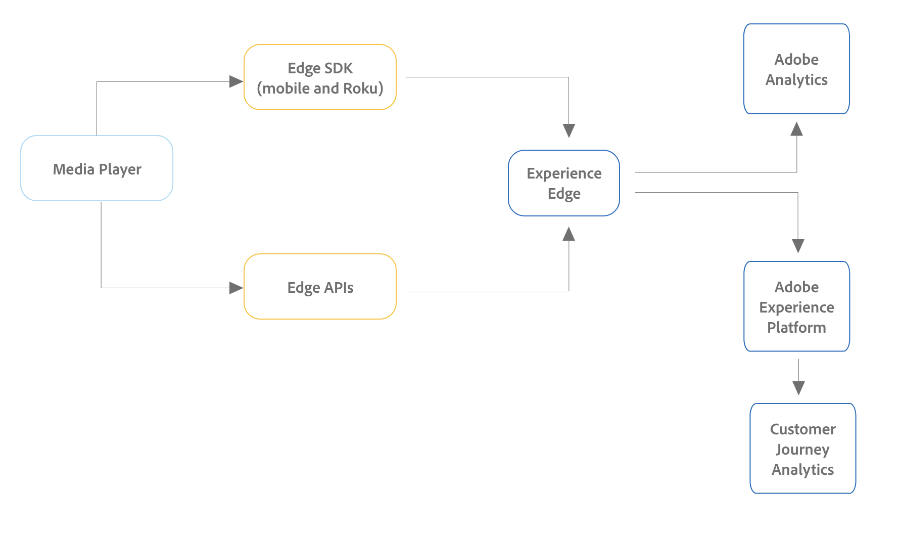
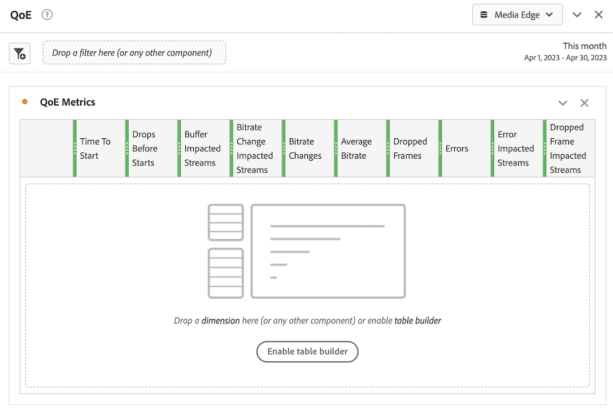

# Install Media Analytics with Experience Platform Edge

Adobe Experience Platform Edge allows you to send data destined to multiple products to a centralized location. Experience Edge forwards the appropriate information to the desired products. This concept allows you to consolidate implementation efforts, especially spanning multiple data solutions.

The following graphic illustrates how a Media Analytics implementation can use Experience Platform Edge to make data available in Analysis Workspace, either in Adobe Analytics or Customer Journey Analytics:

For an overview of all implementation options, including implementation methods that don't use Experience Platform Edge, see [Implement Streaming Media for Adobe Analytics or Customer Journey Analytics](/help/implementation/overview.md).

Regardless of whether you use the Adobe Experience Platform Mobile SDK, the Adobe Experience Platform Roku SDK, the Adobe Experience Platform Web SDK, or the API to implement Streaming Media with Experience Edge, you must first complete the following sections:

## Set up the schema in Adobe Experience Platform 

To standardize data collection for use across applications that leverage Adobe Experience Platform, Adobe has created the open and publicly documented standard, Experience Data Model (XDM).

To create and set up a schema:

1. In Adobe Experience Platform, begin creating the schema as described in [Create and edit schemas in the UI](https://experienceleague.adobe.com/docs/experience-platform/xdm/ui/resources/schemas.html?lang=en).

   When creating the schema, choose [!UICONTROL **XDM ExperienceEvent**] from the [!UICONTROL **Create schema**] drop-down menu.

1. In the [!UICONTROL **Composition**] area, in the [!UICONTROL **Field groups**] section, select [!UICONTROL **Add**], then search for and add the following new field groups to the schema:
   * `Adobe Analytics ExperienceEvent Template`
   * `Implementation Details`
   * `MediaAnalytics Interaction Details`

   After you add the field groups, they should display in the [!UICONTROL **Field groups**] section, as follows:

   

1. Select [!UICONTROL **Confirm**] to save your changes.

1. (Optional) You can hide certain fields that are not used by the Media Edge API. Hiding these fields makes the schema easier to read and understand, but it is not required. These fields refer only to those in the `MediaAnalytics Interaction Details` fieldgroup.

   +++ Expand here to view instructions on fields that you can hide.

   1. In the [!UICONTROL **Structure**] area, select the `Media Collection Details` field, then select [!UICONTROL **Manage related fields**].
   
      

   1. Enable the option to [!UICONTROL **Show display names for fields**], then update the schema as follows:

      * In the `Media Collection Details` > `Advertising Details` field, hide the following reporting fields: `Ad Completed`, `Ad Started`, and `Ad Time Played`.
      
      * In the `Media Collection Details` > `Advertising Pod Details` field, hide the following reporting field: `Ad Break ID`
      
      * In the `Media Collection Details` > `Chapter Details` field, hide the following reporting fields: `Chapter Completed`, `Chapter ID`, `Chapter Started`, and `Chapter Time Played`.
      
      * In the `Media Collection Details` field, hide the `List Of States` field.

        

      * In the `Media Collection Details` > `List Of States End` and `Media Collection Details` > `List Of States Start` field, hide the following reporting fields: `Player State Count`, `Player State Set`, and `Player State Time`.
      
         

      * In the `Media Collection Details` > `Qoe Data Details` field, hide the following reporting fields: `Average Bitrate`, `Average Bitrate Bucket`, `Bitrate Change Impacted Streams`, `Bitrate Changes`, `Buffer Impacted Streams`, `Buffer Events`, `Dropped Frame Impacted Streams`, `Drops Before Starts`, `Errors`, `External Error IDs`, `Error Impacted Streams`, `Media SDK Error IDs`, `Player SDK Error IDs`, `Stalling Impacted Streams`, `Stalling Events`, `Total Buffer Duration`, and `Total Stalling Duration`.

      * In the `Media Collection Details` > `Session Details` field, hide the following reporting fields: `10% Progress Marker`, `25% Progress Marker`, `50% Progress Marker`, `75% Progress Marker`, `95% Progress Marker`, `Ad Count`, `Average Minute Audience`, `Content Completes`, `Chapter Count`, `Content Starts`, `Content Time Spent`, `Estimated Streams`, `Federated Data`, `Media Segment Views`, `Media Downloaded Flag`, `Media Starts`, `Media Session ID`, `Media Session Server Timeout`, `Media Time Spent`, `Pause Events`, `Pause Impacted Streams`, `Pev3`, `Pccr`, `Total Pause Duration`, `Unique Time Played`, and `Video Segment`.

   1. Select [!UICONTROL **Confirm**] to save your changes.

   1. In the [!UICONTROL **Structure**] area, enable the option to [!UICONTROL **Show display names for fields**], then select the `List Of Media Collection Downloaded Content Events` field.
   
   1. Select [!UICONTROL **Manage related fields**], then update the schema as follows:

           
      * In the `List Of Media Collection Downloaded Content Events` > `Media Details` > `Advertising Details` field, hide the following reporting fields: `Ad Completed`, `Ad Started`, and `Ad Time Played`.

      * In the `List Of Media Collection Downloaded Content Events` > `Media Details` > `Advertising Pod Details` field, hide the following reporting field: `Ad Break ID`

      * In the `List Of Media Collection Downloaded Content Events` > `Media Details` > `Chapter Details` field, hide the following reporting fields: `Chapter Completed`, `Chapter ID`, `Chapter Started`, and `Chapter Time Played`.
      
      * In the `List Of Media Collection Downloaded Content Events` > `Media Details` field, hide the `List Of States` field.

      * In the `List Of Media Collection Downloaded Content Events` > `Media Details` > `List Of States End` and `Media Collection Details` > `List Of States Start` field, hide the following reporting fields: `Player State Count`, `Player State Set`, and `Player State Time`.

      * In the `List Of Media Collection Downloaded Content Events` > `Media Details` > `Qoe Data Details` field, hide the following reporting fields: `Average Bitrate`, `Average Bitrate Bucket`, `Bitrate Change Impacted Streams`, `Bitrate Changes`, `Buffer Events`, `Buffer Impacted Streams`, `Drops Before Starts`, `Dropped Frame Impacted Streams`, `Error Impacted Streams`, `Errors`, `External Error IDs`, `Media SDK Error IDs`, `Player SDK Error IDs`, `Stalling Events`, `Stalling Impacted Streams`, `Total Buffer Duration`, and `Total Stalling Duration`.

      * In the `List Of Media Collection Downloaded Content Events` > `Media Details` > `Session Details` field, hide the following reporting fields: `10% Progress Marker`, `25% Progress Marker`, `50% Progress Marker`, `75% Progress Marker`, `95% Progress Marker`, `Ad Count`, `Average Minute Audience`, `Chapter Count`, `Content Completes`, `Content Starts`, `Content Time Spent`, `Estimated Streams`, `Federated Data`, `Media Downloaded Flag`, `Media Segment Views`, `Media Session ID`, `Media Session Server Timeout`, `Media Starts`, `Media Time Spent`, `Pause Events`, `Pause Impacted Streams`, `Pccr`, `Pev3`, `Total Pause Duration`, `Unique Time Played`, and `Video Segment`.

      * In the `List Of Media Collection Downloaded Content Events` > `Media Details`  field, hide the `Media Session ID` field.

   1. Select [!UICONTROL **Confirm**] to save your changes.

   1. In the [!UICONTROL **Structure**] area, select the `Media Reporting Details` field, select [!UICONTROL **Manage related fields**].
   
   1. Enable the option to [!UICONTROL **Show display names for fields**], then update the schema as follows:

      * In the `Media Reporting Details` field, hide the following fields: `Error Details`, `List Of States End`, `List of States Start`, and `Media Session ID`.

   1. Select [!UICONTROL **Confirm**] > [!UICONTROL **Save**]  to save your changes.

1. Continue with [Create a dataset in Adobe Experience Platform](#create-a-dataset-in-adobe-experience-platform).

## Create a dataset in Adobe Experience Platform

1. Ensure that you set up a schema as described in [Set up the Schema in Adobe Experience Platform](#set-up-the-schema-in-adobe-experience-platform).

1. In Adobe Experience Platform, begin creating the dataset as described in [Datasets UI guide](https://experienceleague.adobe.com/docs/experience-platform/catalog/datasets/user-guide.html?lang=en#create).

   When selecting a schema for your dataset, choose the schema that you previously created, as described in [Set up the Schema in Adobe Experience Platform](#set-up-the-schema-in-adobe-experience-platform).

1. Continue with [Configure a datastream in Customer Journey Analytics](#configure-a-datastream-in-adobe-experience-platform).

## Configure a datastream in Adobe Experience Platform

1. Ensure that you created a dataset as described in [Create a dataset in Adobe Experience Platform](#create-a-dataset-in-adobe-experience-platform).

1. Create a new datastream as described in [Configure a datastream](https://experienceleague.adobe.com/docs/experience-platform/edge/datastreams/configure.html?lang=en).

   When creating the datastream, ensure that you make the following configuration selections:

   * In the [!UICONTROL **Event Schema**] field when creating the datastream, ensure that you select the schema that you created in [Set up the schema in Adobe Experience Platform](#set-up-the-schema-in-adobe-experience-platform). Select [!UICONTROL **Save**]. 
   
     >[!IMPORTANT]
     >
     >     Do not select [!UICONTROL **Save and Add Mapping**] because doing so will result in mapping errors for the Timestamp field.

     

   * Add either of the following services to the datastream, depending on whether you are using Adobe Analytics or Customer Journey Analytics: 
   
     * [!UICONTROL **Adobe Analytics**] (if using Adobe Analytics)

       If you are using Adobe Analytics, make sure you define a report suite, as described in the section [Define a report suite](#define-a-report-suite) in this article.

     * [!UICONTROL **Adobe Experience Platform**] (if using Customer Journey Analytics)
     
     For information about how to add a service to a datastream, see the "Add services to a datastream" section in [Configure a datastream](https://experienceleague.adobe.com/docs/experience-platform/edge/datastreams/configure.html?lang=en#view-details).

     

    * Expand [!UICONTROL **Advanced Options**], then enable the [!UICONTROL **Media Analytics**] option. 

      

1. You are now ready to implement the [Media Edge API](/help/implementation/edge/implementation-edge-api.md) or [Media Edge SDK](/help/implementation/edge/edge-mobile-sdk.md) to start collecting media analytics data. 

   After you have collected some data, you can [Create a connection in Customer Journey Analytics](#create-a-connection-in-customer-journey-analytics).

## Create a connection in Customer Journey Analytics

>[!NOTE]
>
>The following procedure is required only if you are using Customer Journey Analytics. 

1. Ensure that you created a datastream as described in [Configure a datastream in Customer Journey Analytics](#configure-a-datastream-in-adobe-experience-platform).

1. In Customer Journey Analytics, create a connection as described in [Create a connection](https://experienceleague.adobe.com/docs/analytics-platform/using/cja-connections/create-connection.html?lang=en).

   When creating the connection, the following configuration selections are required for implementing Streaming Media:

   1. Select the dataset that you previously created, as described in [Create a dataset in Adobe Experience Platform](#create-a-dataset-in-adobe-experience-platform).

   1. Ensure that the [!UICONTROL **Import all new data**] setting is enabled.

1. Continue with [Create a data view in Customer Journey Analytics](#create-a-new-data-view-in-customer-journey-analytics).

## Create a data view in Customer Journey Analytics

>[!NOTE]
>
>The following procedure is required only if you are using Customer Journey Analytics. 

1. Ensure that you created a connection in Customer Journey Analytics as described in [Create a connection in Customer Journey Analytics](#create-a-connection-in-customer-journey-analytics).

1. In Customer Journey Analtyics, create a data view as described in [Create or edit a data view](https://experienceleague.adobe.com/docs/analytics-platform/using/cja-dataviews/create-dataview.html?lang=en).

   When creating the data view, the following configuration selections are required for implementing Streaming Media:

   1. In the [!UICONTROL **Connection**] field, select the connection that you previously created, as described in [Create a connection in Customer Journey Analytics](#create-a-connection-in-customer-journey-analytics).

      It can take up to 15 minutes before the connection that you created is available to select.

   1. On the [!UICONTROL **Components**] tab, in the [!UICONTROL **Schema fields**] section, search for each component listed in the tables below and drag it into the [!UICONTROL **Metrics**] panel. If multiple fields of the same name exist, use the XDM path to ensure that it's the correct field.

      **Main content - Content metrics**

      | Component name | XDM path |
      |----------|---------|
      | Media Starts | mediaReporting.sessionDetails.isViewed |
      | Media Segment Views | mediaReporting.sessionDetails.hasSegmentView |
      | Content Starts | mediaReporting.sessionDetails.isPlayed |
      | Content Completes | mediaReporting.sessionDetails.isCompleted |
      | Content Time Spent | mediaReporting.sessionDetails.timePlayed |
      | Media Time Spent | mediaReporting.sessionDetails.totalTimePlayed |
      | Unique Time Played | mediaReporting.sessionDetails.uniqueTimePlayed |
      | 10% Progress Marker | mediaReporting.sessionDetails.hasProgress10 |
      | Average Minute Audience | mediaReporting.sessionDetails.averageMinuteAudience |

      
      **Chapter & Ads - Chapter & Ads metrics**

      | Component name | XDM path |
      |----------|---------|
      | Chapter Started | mediaReporting.chapterDetails.isStarted |
      | Chapter Completed | mediaReporting.chapterDetails.isCompleted |
      | Chapter Time Played | mediaReporting.chapterDetails.timePlayed |
      | Ad Started | mediaReporting.advertisingDetails.isStarted |
      | Ad Completed | mediaReporting.advertisingDetails.isCompleted |
      | Ad Time Played | mediaReporting.advertisingDetails.timePlayed |

      **QoE - QoE metrics**

      | Component name | XDM path |
      |----------|---------|
      | Time To Start | mediaReporting.qoeDataDetails.timeToStart |
      | Drops Before Starts | mediaReporting.qoeDataDetails.isDroppedBeforeStart |
      | Buffer Impacted Streams | mediaReporting.qoeDataDetails.hasBufferImpactedStreams |
      | Bitrate Change Impacted Streams | mediaReporting.qoeDataDetails.hasBitrateChangeImpactedStreams |
      | Bitrate Changes | mediaReporting.qoeDataDetails.bitrateChangeCount |
      | Average Bitrate | mediaReporting.qoeDataDetails.bitrateAverage |
      | Dropped Frames | mediaReporting.qoeDataDetails.droppedFrames |
      | Errors | mediaReporting.qoeDataDetails.errorCount |
      | Error Impacted Streams | mediaReporting.qoeDataDetails.hasErrorImpactedStreams |
      | Dropped Frame Impacted Streams | mediaReporting.qoeDataDetails.hasDroppedFrameImpactedStreams |

      **Player state - Player state metrics**

      | Component name | XDM path |
      |----------|---------|
      | Player State Set | mediaReporting.states.isSet |
      | Player State Count | mediaReporting.states.count |
      | Player State Time | mediaReporting.states.time |

   1. Update the labels (in the [!UICONTROL **Context labels**] drop-down menu) for the components in the following table. Search for and drag any components that are not already in the metrics panel into the panel.

      | Component name | Context label | 
      |---------|----------|
      | Media Session Server Timeout | Media: Seconds Since Last Call | 
      | Media Time Spent | Media: Media Time Spent |
      | Total Buffer Duration | Media: Total Buffer Duration |
      | Time to Start | Media: Time To Start |
      | Total Pause Duration | Media: Total Pause Duration |

   1. To add breakdowns to your Customer Journey Analytics project, add the following dimensions to the [!UICONTROL **Dimensions**] panel:
      
      |XDM path | Component name | 
      |---------|----------|
      | mediaReporting.states.name | Player State Name | 
      | mediaReporting.sessionDetails.ID | Media Session ID |

      In addition to the dimensions in this table, you can add in any other dimensions that you want to make available to filter data by in Customer Journey Analytics projects.

1. Select [!UICONTROL **Save and continue**] > [!UICONTROL **Save and finish**] to save your changes.

1. Continue with [Create and configure a project in Customer Journey Analytics](#create-and-configure-a-project-in-customer-journey-analytics).

## Create and configure a project in Customer Journey Analytics

1. Ensure that you created a data view in Customer Journey Analytics as described in [Create a data view in Customer Journey Analytics](#create-a-new-data-view-in-customer-journey-analytics).

1. In Customer Journey Analytics, in the [!UICONTROL **Workspace**] tab, in the [!UICONTROL **Projects**] area, select [!UICONTROL **Create project**].

1. Select [!UICONTROL **Blank project**] > [!UICONTROL **Create**].

1. In the new project, select the data view that you previously created.

   When creating panels in your project, you can use any components that you added to your data view, as described in [Create a data view in Customer Journey Analytics](#create-a-new-data-view-in-customer-journey-analytics). 

   The following 4 panels are examples of panels that you could create:

   

   

   

   

1. Select the **Panels** icon in the left rail, then drag in the [!UICONTROL **Media concurrent viewers**] panel and the [!UICONTROL **Media playback time spent**] panel. 

   The 2 panels should look like this:

   

   

1. Share the project as described in [Share projects](https://experienceleague.adobe.com/docs/analytics-platform/using/cja-workspace/curate-share/share-projects.html?lang=en).

   >[!NOTE]
   >
   >   If the users you want to share with are not available, make sure the users have user and admin access to Customer Journey Analytics in the Adobe Admin Console.

1. Continue with [Send data to Experience Platform Edge](#send-data-to-experience-platform-edge).

## Send data to Experience Platform Edge

Depending on the type of data that you want to send to Experience Platform Edge, you can use any of the following methods:

### Web: Use the Adobe Experience Platform Web SDK

### Mobile: Use the Adobe Experience Platform Mobile SDK

Use the following documentation resources to complete the implementation for both iOS and Android:

* [Get started](https://developer.adobe.com/client-sdks/documentation/media-for-edge-network/)

* [API reference](https://developer.adobe.com/client-sdks/documentation/media-for-edge-network/api-reference/)

* [Migrate to Adobe Streaming Media for Edge Network extension](https://developer.adobe.com/client-sdks/documentation/adobe-media-analytics/migration-guide/)

### Roku: Adobe Experience Platform Roku SDK

* [Get started](https://developer.adobe.com/client-sdks/documentation/media-for-edge-network/)

* [Adobe Experience Platform Roku SDK](https://github.com/adobe/aepsdk-roku/tree/main)  

* [Migrate to Adobe Streaming Media for Edge Network extension](https://developer.adobe.com/client-sdks/documentation/adobe-media-analytics/migration-guide/) <!-- is the information here also applicable for Roku? -->

### API: Web and other

The API is currently the only supported way to send web data to Experience Platform Edge. 

The API is also available if you want to use a custom implementation of the Edge APIs. 

For more information about the media Edge API, see the following resources:

* [Media Edge API overview](https://experienceleague.adobe.com/docs/experience-platform/edge-network-server-api/media-edge-apis/overview.html)

* [Media Edge API getting started](https://experienceleague.adobe.com/docs/experience-platform/edge-network-server-api/media-edge-apis/getting-started.html)

* [Media Edge API troubleshooting guide](https://experienceleague.adobe.com/docs/experience-platform/edge-network-server-api/media-edge-apis/troubleshooting.html)

* [Using the Open API Specification file for Media Edge APIs](https://experienceleague.adobe.com/docs/experience-platform/edge-network-server-api/media-edge-apis/swagger.html)
