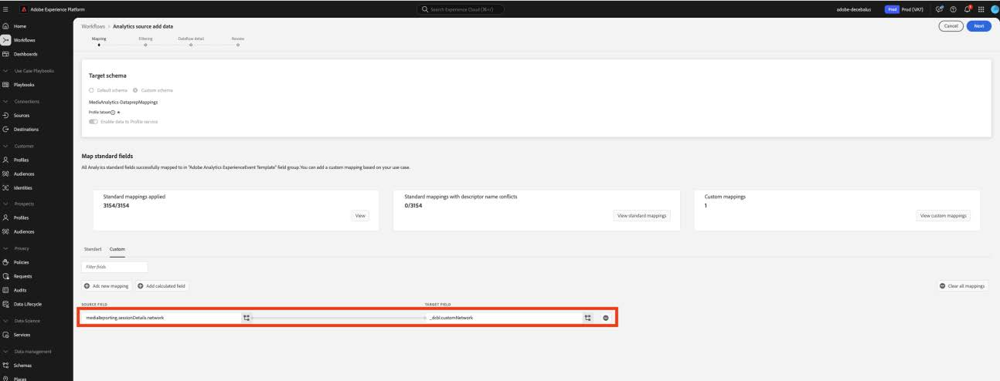

# Migrate Data Prep for custom fields to the new streaming media fields

This document describes the process of migrating the Data Prep service that exists on top of the Adobe Data Collection flows that are enabled for Adobe Streaming Media Collection data. The migration converts a Data Prep mapping from the Adobe Streaming Media Collection data type called "Media" to use the new corresponding data type called "[Media Reporting Details](https://experienceleague.adobe.com/en/docs/experience-platform/xdm/data-types/media-reporting-details)."

## Migrate Data Prep for custom fields

To migrate the Data Prep mappings from the old data type called "Media" to the new data type called "[Media Reporting Details](https://experienceleague.adobe.com/en/docs/experience-platform/xdm/data-types/media-reporting-details)," you must edit the Data Prep mappings:

>[!IMPORTANT]
>
>To avoid losing data, ensure that the Analytics source connector has been deployed using the new `mediaReporting` fields before completing the steps in this section. 

1. In Adobe Experience Platform, under the **[!UICONTROL Sources]** section, go to the **[!UICONTROL Dataflows]** tab.

1. Locate the dataflow responsible for importing streaming media data from Adobe Analytics to Adobe Experience Platform via Adobe Data Collection. 

1. Select **[!UICONTROL Update dataflow]** to modify the Data Prep setup by replacing every custom source mapping that contains a deprecated field with the new corresponding field from the new XDM object.

1. Locate the mappings containing source fields from the deprecated "Media" object.

1. Replace those sources by using fields from the new "Media Reporting Details" object.

1. Validate that the mappings are still working as expected.

See the [Content ID](/help/reporting/dimensions/content.md) parameter and the rest of the streaming media variables documented under [Streaming media services](/help/media-overview.md) to map between the old fields and the new fields. The old field path is found under the "XDM Field Path" property while the new field path is found under the "Reporting XDM Field Path" property.

## Example

To make it easier to follow the migration guidelines, consider the following example dataflow that contains a single mapping. In this case, you need to apply the migration guidelines only once.

1. In Adobe Experience Platform, under the **[!UICONTROL Sources]** section, go to the **[!UICONTROL Dataflows]** tab. 

1. Locate the dataflow responsible for importing streaming media data from Adobe Analytics to Adobe Experience Platform via Adobe Data Collection. 

1. Select **[!UICONTROL Update dataflow]** to enter the editing UI as shown in the below image.

   

1. In the **[!UICONTROL Mapping]** tab, select **[!UICONTROL Custom]**.

1. Identify the custom mappings that rely on `media.mediaTimed` fields as sources.

   

   In this example, because you created a custom field group on the schema in your development organization, the target field is under `_dcbl`. The custom field group path differs based on the organization name.

1. For each mapping that uses the `media.mediaTimed` object, find its correspondent in the `mediaReporting` object using this documentation. 

   As an example, for Network, the correspondent for `media.mediaTimed.primaryAssetViewDetails`.broadcastNetwork is `xdm.mediaReporting.sessionDetails.network`.

   

1. In the **[!UICONTROL Source field]** field, replace the `media.mediaTimed` path with the `mediaReporting` path. The target field remains unchanged.

   

1. Select **[!UICONTROL Next]** to save your changes.

   The status shows as **[!UICONTROL Processing]**. After the changes are applied, the status shows as **[!UICONTROL Enabled]**. 

   

## Example with different data types

In the above example, all of the data types involved were String, so the mapping replacement was direct.

If the source field data type is different than the target field data type, you need to follow the guidelines in the [Data Prep troubleshooting guide](https://experienceleague.adobe.com/en/docs/experience-platform/data-prep/troubleshooting-guide), [Handling data formats with Data Prep](https://experienceleague.adobe.com/en/docs/experience-platform/data-prep/data-handling), and [Data Prep mapping functions](https://experienceleague.adobe.com/en/docs/experience-platform/data-prep/data-handling).

For example, if the source type is a string and the target type is a boolean, Data Prep can automatically parse the value and convert the source value to a boolean. 

If the source type is a number and the target type is a boolean, you need to use data manipulation functions:

Mapping with `media.mediaTimed` to a custom field.

Mapping with `mediaReporting` to the same custom field:

