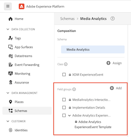
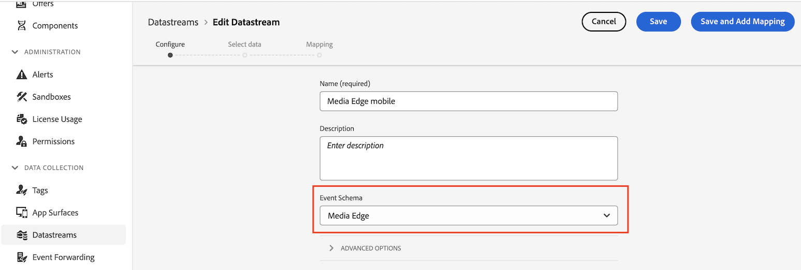

# Edge implementation overview

The Adobe Experience Platform Edge Network lets you send data destined for multiple products to a single endpoint, which then forwards the appropriate information to each product. This is the recommended way to implement the Streaming Media Collection — and is the only approach that supports both Adobe Analytics and Customer Journey Analytics from a single instrumentation.

In contrast to the legacy Media SDK approach, which required product-specific instrumentation for each Adobe solution, an Edge implementation uses a shared XDM data model and a single datastream. Data flows from your SDK or API to the Edge Network, which then routes it to whichever Adobe products are configured in the datastream (Analytics, CJA, AJO, or RTCDP). This means switching or adding downstream products later does not require re-instrumenting your media events.

Regardless of which codebase you use — the Web SDK, the Mobile SDK (iOS or Android), the Roku SDK, or the Media Edge API — you must first complete the platform setup described on this page: create a schema, create a dataset, and configure a datastream.

## Prerequisites

1. **Complete the general prerequisites.** See the [general prerequisites](/help/getting-started/prereqs.md).

1. **Confirm a compatible Adobe solution.** You must have a working implementation of at least one of the following:
   * [Customer Journey Analytics](https://experienceleague.adobe.com/docs/analytics-platform/using/cja-landing.html?lang=en) — the primary reporting destination for Edge-based media data
   * [Adobe Analytics](https://experienceleague.adobe.com/docs/analytics/implementation/home.html) — supported alongside or instead of CJA via the same datastream
   * [Adobe Journey Optimizer](https://experienceleague.adobe.com/docs/journey-optimizer.html) or [Real-Time Customer Data Platform](https://experienceleague.adobe.com/docs/real-time-customer-data-platform.html) — add the **[!UICONTROL Adobe Experience Platform]** service to your datastream when configuring either of these

## Set up the schema in Adobe Experience Platform

To standardize data collection across applications that use Adobe Experience Platform, Adobe created the open, publicly documented Experience Data Model (XDM) standard.

1. In Adobe Experience Platform, begin creating the schema as described in [Create and edit schemas in the UI](https://experienceleague.adobe.com/docs/experience-platform/xdm/ui/resources/schemas.html?lang=en).

1. On the Schema details page, choose **[!UICONTROL Experience Event]** as the base class for the schema.

   

1. Select **[!UICONTROL Next]**.

1. Specify a schema display name and description, then select **[!UICONTROL Finish]**.

1. In the **[!UICONTROL Composition]** area, in the **[!UICONTROL Field groups]** section, select **[!UICONTROL Add]**, then search for and add the following field groups to the schema:
   * `End User ID Details`
   * `Implementation Details`
   * `MediaAnalytics Interaction Details`

   After you add the field groups, they display in the **[!UICONTROL Field groups]** section:

   

1. Select **[!UICONTROL Save]** to save your changes.

1. (Optional) You can hide certain fields from the schema UI. These fields are server-computed reporting fields that Adobe populates on the backend — they are not sent by your SDK or API and do not affect data collection. Hiding them has no functional impact; it only reduces visual noise when browsing the schema in the AEP UI. These fields refer only to those in the `MediaAnalytics Interaction Details` field group.

   +++ Expand to view instructions on fields you can hide.

   1. In the **[!UICONTROL Structure]** area, select the `Media Collection Details` field, then select **[!UICONTROL Manage related fields]**.

      

   1. Enable the option to **[!UICONTROL Show display names for fields]**, then update the schema as follows:

      * In the `Media Collection Details` > `Advertising Details` field, hide the following reporting fields: `Ad Completed`, `Ad Started`, and `Ad Time Played`.

      * In the `Media Collection Details` > `Advertising Pod Details` field, hide the following reporting field: `Ad Break ID`

      * In the `Media Collection Details` > `Chapter Details` field, hide the following reporting fields: `Chapter Completed`, `Chapter ID`, `Chapter Started`, and `Chapter Time Played`.

      * In the `Media Collection Details` field, hide the `List Of States` field.

        

      * In the `Media Collection Details` > `List Of States End` and `Media Collection Details` > `List Of States Start` field, hide the following reporting fields: `Player State Count`, `Player State Set`, and `Player State Time`.

         

      * In the `Media Collection Details` > `Qoe Data Details` field, hide the following reporting fields: `Average Bitrate`, `Average Bitrate Bucket`, `Bitrate Change Impacted Streams`, `Bitrate Changes`, `Buffer Impacted Streams`, `Buffer Events`, `Dropped Frame Impacted Streams`, `Drops Before Starts`, `Errors`, `External Error IDs`, `Error Impacted Streams`, `Media SDK Error IDs`, `Player SDK Error IDs`, `Stalling Impacted Streams`, `Stalling Events`, `Total Buffer Duration`, and `Total Stalling Duration`.

      * In the `Media Collection Details` > `Session Details` field, hide the following reporting fields: `10% Progress Marker`, `25% Progress Marker`, `50% Progress Marker`, `75% Progress Marker`, `95% Progress Marker`, `Ad Count`, `Average Minute Audience`, `Content Completes`, `Chapter Count`, `Content Starts`, `Content Time Spent`, `Estimated Streams`, `Federated Data`, `Media Segment Views`, `Media Downloaded Flag`, `Media Starts`, `Media Session ID`, `Media Session Server Timeout`, `Media Time Spent`, `Pause Events`, `Pause Impacted Streams`, `Pev3`, `Pccr`, `Total Pause Duration`, `Unique Time Played`, and `Video Segment`.

   1. Select **[!UICONTROL Confirm]** to save your changes.

   1. In the **[!UICONTROL Structure]** area, enable the option to **[!UICONTROL Show display names for fields]**, then select the `List Of Media Collection Downloaded Content Events` field.

   1. Select **[!UICONTROL Manage related fields]**, then update the schema as follows:

      * In the `List Of Media Collection Downloaded Content Events` > `Media Details` > `Advertising Details` field, hide the following reporting fields: `Ad Completed`, `Ad Started`, and `Ad Time Played`.

      * In the `List Of Media Collection Downloaded Content Events` > `Media Details` > `Advertising Pod Details` field, hide the following reporting field: `Ad Break ID`

      * In the `List Of Media Collection Downloaded Content Events` > `Media Details` > `Chapter Details` field, hide the following reporting fields: `Chapter Completed`, `Chapter ID`, `Chapter Started`, and `Chapter Time Played`.

      * In the `List Of Media Collection Downloaded Content Events` > `Media Details` field, hide the `List Of States` field.

      * In the `List Of Media Collection Downloaded Content Events` > `Media Details` > `List Of States End` and `Media Collection Details` > `List Of States Start` field, hide the following reporting fields: `Player State Count`, `Player State Set`, and `Player State Time`.

      * In the `List Of Media Collection Downloaded Content Events` > `Media Details` > `Qoe Data Details` field, hide the following reporting fields: `Average Bitrate`, `Average Bitrate Bucket`, `Bitrate Change Impacted Streams`, `Bitrate Changes`, `Buffer Events`, `Buffer Impacted Streams`, `Drops Before Starts`, `Dropped Frame Impacted Streams`, `Error Impacted Streams`, `Errors`, `External Error IDs`, `Media SDK Error IDs`, `Player SDK Error IDs`, `Stalling Events`, `Stalling Impacted Streams`, `Total Buffer Duration`, and `Total Stalling Duration`.

      * In the `List Of Media Collection Downloaded Content Events` > `Media Details` > `Session Details` field, hide the following reporting fields: `10% Progress Marker`, `25% Progress Marker`, `50% Progress Marker`, `75% Progress Marker`, `95% Progress Marker`, `Ad Count`, `Average Minute Audience`, `Chapter Count`, `Content Completes`, `Content Starts`, `Content Time Spent`, `Estimated Streams`, `Federated Data`, `Media Downloaded Flag`, `Media Segment Views`, `Media Session ID`, `Media Session Server Timeout`, `Media Starts`, `Media Time Spent`, `Pause Events`, `Pause Impacted Streams`, `Pccr`, `Pev3`, `Total Pause Duration`, `Unique Time Played`, and `Video Segment`.

      * In the `List Of Media Collection Downloaded Content Events` > `Media Details` field, hide the `Media Session ID` field.

   1. Select **[!UICONTROL Confirm]** to save your changes.

   1. In the **[!UICONTROL Structure]** area, select the `Media Reporting Details` field, then select **[!UICONTROL Manage related fields]**.

   1. Enable the option to **[!UICONTROL Show display names for fields]**, then update the schema as follows:

      * In the `Media Reporting Details` field, hide the following fields: `Error Details`, `List Of States End`, `List of States Start`, and `Media Session ID`.

   1. Select **[!UICONTROL Confirm]** > **[!UICONTROL Save]** to save your changes.

   +++

1. (Optional) You can add custom metadata to your schema. This lets you include additional, user-defined metadata for specific needs or contexts. For more information about custom metadata with the Media Edge API, see [Custom metadata support](custom-metadata.md).

   +++ Expand to view instructions on adding custom metadata to your schema.

    1. Locate the tenant name of the org by selecting **[!UICONTROL Account info]** > **[!UICONTROL Assigned orgs]** > [!UICONTROL _**org name**_] > **[!UICONTROL tenant]**.

       Custom fields are received through this path. (For example, tenant name: _dcbl → myCustomField path: _dcbl.myCustomField.)

    1. Add a custom field group to your defined media schema.

       

    1. Add any custom fields that you want to track to the field group.

       

    1. [Use the path generated](https://experienceleague.adobe.com/en/docs/experience-platform/xdm/ui/fields/overview#type-specific-properties) for the custom field in your request payload.

       

   +++

## Create a dataset in Adobe Experience Platform

1. In Adobe Experience Platform, begin creating the dataset as described in the [Datasets UI guide](https://experienceleague.adobe.com/docs/experience-platform/catalog/datasets/user-guide.html?lang=en#create).

   When selecting a schema for your dataset, choose the schema that you previously created.

## Configure a datastream in Adobe Experience Platform

1. Create a new datastream as described in [Configure a datastream](https://experienceleague.adobe.com/docs/experience-platform/edge/datastreams/configure.html?lang=en).

   When creating the datastream, make the following selections:

   * In the **[!UICONTROL Event Schema]** field, select the schema that you created in [Set up the schema in Adobe Experience Platform](#set-up-the-schema-in-adobe-experience-platform).

     >[!IMPORTANT]
     >
     >Select **[!UICONTROL Save]**; do not select **[!UICONTROL Save and Add Mapping]**. Selecting **[!UICONTROL Save and Add Mapping]** causes mapping errors for the Timestamp field.

     

   * Add the appropriate service(s) to the datastream based on your Adobe solution. For information about adding a service, see "Add services to a datastream" in [Configure a datastream](https://experienceleague.adobe.com/docs/experience-platform/edge/datastreams/configure.html?lang=en#view-details).

     * **[!UICONTROL Adobe Analytics]** (if using Adobe Analytics) — define a report suite as described in [Create a report suite](https://experienceleague.adobe.com/en/docs/analytics/admin/admin-tools/manage-report-suites/c-new-report-suite/t-create-a-report-suite).

     * **[!UICONTROL Adobe Experience Platform]** (if using Customer Journey Analytics, Adobe Journey Optimizer, or Real-Time Customer Data Platform)

     

   * Expand **[!UICONTROL Advanced Options]**, then enable the **[!UICONTROL Media Analytics]** option.

      

## Choose your implementation method

With the schema, dataset, and datastream in place, implement one of the following codebases to start sending streaming media data to the Edge Network. Each page covers the streaming-media-specific setup; the per-event and per-variable code lives in [Events](/help/implementation/events/overview.md) and [Variables](/help/implementation/variables/overview.md).

**In-code** implementations write SDK calls directly in your application source code. **Using Tags** implementations use [Adobe Experience Platform Tags](https://experienceleague.adobe.com/en/docs/experience-platform/tags/home) which lets you configure and deploy tracking rules without modifying your application code. Choose whichever approach fits your deployment workflow.

| Codebase | In-code | Using Tags |
|---|---|---|
| Web | [Web SDK](web-sdk.md) | [Web SDK tag extension](web-sdk-tags.md) |
| iOS | [iOS](ios.md) | [iOS (Tags)](ios-tags.md) |
| Android | [Android](android.md) | [Android (Tags)](android-tags.md) |
| Roku | [Roku](roku.md) | — |
| API | [Media Edge API](media-edge-api.md) | — |

## Next step

After you begin collecting data, you can configure reporting:

* [Set up reporting for Edge implementations](/help/reporting/setup/edge-reporting.md) (Customer Journey Analytics)
* [Set up reporting for Analytics-only implementations](/help/reporting/setup/analytics-reporting.md) (if your datastream feeds Adobe Analytics)

>[!MORELIKETHIS]
>
>* [Custom metadata support](custom-metadata.md)
>* [XDM reporting schema](reporting-schema.md)
>* [Events overview](/help/implementation/events/overview.md)
