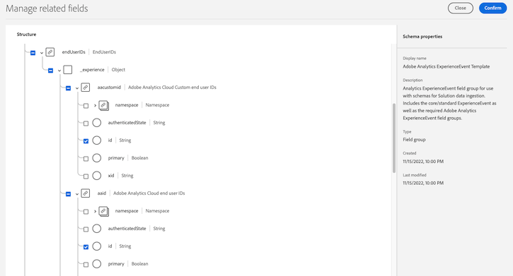
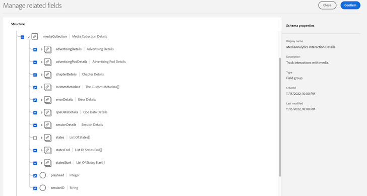

# Install Analytics with Adobe Experience Platform Edge

{{release-limited-testing}}

Adobe Experience Platform Edge allows you to send data destined to multiple products to a centralized location. Experience Edge forwards the appropriate information to the desired products. This concept allows you to consolidate implementation efforts, especially spanning multiple data solutions.

You can send data to Experience Edge using any of the following methods:

* Adobe Experience Platform Web SDK (Coming soon)
* Adobe Experience Platform Mobile SDK
* Edge Network Server API

## Set up the schema in Adobe Experience Platform 

Regardless of which Experience Edge implementation method you use, you must set up the schema.

To standardize data collection for use across applications that leverage Adobe Experience Platform, Adobe has created the open and publicly documented standard, Experience Data Model (XDM)

To create and set up a schema:

1. In Adobe Experience Platform, begin creating the schema as described in [Create and edit schemas in the UI](https://experienceleague.adobe.com/docs/experience-platform/xdm/ui/resources/schemas.html?lang=en).

1. Add the following new field groups to the schema:
   * Adobe Analytics ExperienceEvent Template
   * Implementation Details
   * MediaAnalytics Interaction Details

1. Hide the following fields from the schema:
   * In the `endUserIds` field group, hide all fields except for `endUserIDs._experience.aacustomid.id` and `endUserIDs._experience.aaid.id`.
    For example:
    
   * In the `implementationDetails` field group, hide all fields except for `version`.
     For example:
     
   * In the `mediaCollection` field group, hide the `states` field.
   * In the `mediaCollection.advertisingDetails` field group, hide the frollowing reporting fields: `isCompleted`, `isStarted`, and `timePlayed`.
   * In the `mediaCollection.advertisingPodDetails` field group, hide the following reporting field: `ID`
   * In the `mediaCollection.chapterDetails` field group, hide the following reporting fields: `ID`, `isCompleted`, `isStarted`, and `timePlayed`.
   * In the `mediaCollection.qoeDataDetails`field group, hide the following reporting fields: `bitrateAverage`, `bitrateAverageBucket`, `bitrateChangeCount`, `bufferCount`, `bufferTime`, `errorCount`, `externalErrors`, `hasBitrateChangeImpactedStreams`, `hasBufferImpactedStreams`, `hasDroppedFrameImpactedStreams`, `hasErrorImpactedStreams`, `hasStallImpactedStreams`, `isDroppedBeforeStart`, `mediaSdkErrors`, `playerSdkErrors`, `stallCount`, and `stallTime`.
   * In the `mediaCollection.sessionDetails` field group, hide the following reporting fields: `ID`, `adCount`, `averageMinuteAudience`, `chapterCount`, `estimatedStreams`, `hasPauseImpactedStreams`, `hasProgress10`, `hasProgress25`, `hasProgress50`, `hasProgress75`, `hasProgress95`, `hasSegmentView`, `isCompleted`, `isDownloaded`, `isFederated`, `isPlayed`, `isViewed`, `pauseCount`, `pauseTime`, `secondsSinceLastCall`, `segment`, `timePlayed`, `totalTimePlayed`, `uniqueTimePlayed`, `pev3`, and `pccr`.
   * In the `mediaCollection.statesEnd` and `mediaCollection.statesStart` field groups, hide the following reporting fields: `count`, `isSet`, and `time`.
   For example:
   
   * `mediaDownloadedEvents` is an array with mediaCollection datatypes, which has the same format as the mediaCollection described above, just also uncheck the sessionID field. <!--what does this mean?-->
   * In the `mediaReporting` field group, hide the following collection fields: `errorDetails`, `statesEnd`, `statesStart`, `playhead`, and `sessionID`.

1. Continue with [Create a dataset in Adobe Experience Platform](#create-a-dataset-in-adobe-experience-platform).

## Create a dataset in Adobe Experience Platform

Regardless of which Experience Edge implementation method you use, you must create a dataset.

1. Ensure that you have set up a schema, as described in [Set up the Schema in Adobe Experience Platform](#set-up-the-schema-in-adobe-experience-platform).

1. In Adobe Experience Platform, begin creating the dataset as described in [Datasets UI guide](https://experienceleague.adobe.com/docs/experience-platform/catalog/datasets/user-guide.html?lang=en#create).

>[!NOTE]
>
>   When selecting a schema for your dataset, choose the schema that you previously created, as described in [Set up the Schema in Adobe Experience Platform](#set-up-the-schema-in-adobe-experience-platform).

## Create a connection in Customer Journey Analytics

1. 

1. Continue with one of the following sections, depending on which Experience Edge implementation you plan to use:

+++Adobe Experience Platform Web SDK (Coming soon)

<!-- Content initially copied from here: https://experienceleague.adobe.com/docs/analytics/implementation/aep-edge/web-sdk/overview.html?lang=en -->

Use the Web SDK extension in Adobe Experience Platform Data Collection to send data to Edge.

You can use the [Adobe Experience Platform Web SDK](https://experienceleague.adobe.com/docs/experience-platform/tags/extensions/client/sdk/overview.html) to send data to Adobe Analytics. This implementation method works by translating the [Experience Data Model (XDM)](https://experienceleague.adobe.com/docs/experience-platform/xdm/home.html) into a format used by Analytics.

You can send data to Experience Edge directly using the Web SDK, or through the Web SDK extension in Tags.

## Web SDK

A high-level overview of the implementation tasks:

<table style="width:100%">

<tr>
<th style="width:5%"></th><th style="width:60%"><b>Task</b></th><th style="width:35%"><b>More Information</b></th>
</tr>

<tr>
<td>1</td>
<td>Ensure you have <b>defined a report suite</b>.</td>
<td><a href="../../../admin/admin/c-manage-report-suites/report-suites-admin.md">Report Suite Manager</a></td>
</tr>

<tr>
<td>2</td>
<td><b>Setup schemas and datasets</b>. To standardize data collection for use across applications that leverage Adobe Experience Platform, Adobe has created the open and publicly documented standard, Experience Data Model (XDM).</td>
<td><a href="https://experienceleague.adobe.com/docs/experience-platform/xdm/ui/overview.html?lang=en">Schemas UI overview</a> and <a href="https://experienceleague.adobe.com/docs/experience-platform/catalog/datasets/user-guide.html?lang=en">Datasets UI overview</a></td>
</tr>

<tr>
<td>3</td>
<td><b>Create a data layer</b> to manage the tracking of the data on your website.</td>
<td><a href="../../prepare/data-layer.md">Create a data layer</a></td>
</tr>

<tr>
<td> 4</td>
<td><b>Install the prebuilt standalone version</b>. You can reference the library (<code>alloy.js</code>) on the CDN directly on your page or download and host it on your own infrastructure. Alternatively, you can use the NPM package.</td>
<td><a href="https://experienceleague.adobe.com/docs/experience-platform/edge/fundamentals/installing-the-sdk.html?lang=en#option-2%3A-installing-the-prebuilt-standalone-version">Installing the prebuilt standalone version</a> and <a href="https://experienceleague.adobe.com/docs/experience-platform/edge/fundamentals/installing-the-sdk.html?lang=en#option-3%3A-using-the-npm-package">Using the NPM package</a></td>
</tr>

<tr>
<td>5</td>
<td><b>Configure a datastream</b>. A datastream represents the server-side configuration when implementing the Adobe Experience Platform Web SDK.</td>
<td><a href="https://experienceleague.adobe.com/docs/experience-platform/edge/datastreams/configure.html?lang=en">Configure a datastream<a></td> 
</tr>

<td>6</td>
<td><b>Add an Adobe Analytics service</b> to your datastream. That service controls whether and how data is sent to Adobe Analytics.</td>
<td><a href="https://experienceleague.adobe.com/docs/experience-platform/edge/datastreams/configure.html?lang=en#analytics">Add Adobe Analytics service to a datastream</a></td>
</tr>

<tr>
<td>7</td>
<td><b>Configure the Web SDK</b>. Ensure the library that you installed in step 4 is properly configured with the datastream ID (formerly known as edge configuration id (<code>edgeConfigId</code>)), organization id (<code>orgId</code>), and other available options.</td>
<td><a href="https://experienceleague.adobe.com/docs/experience-platform/edge/fundamentals/configuring-the-sdk.html?lang=en">Configure the Web SDK</a></td>
</tr>

<tr>
<td>8</td>
<td><b>Execute commands</b> and/or <b>track events</b>. After the base code has been implemented on your webpage, you can begin executing commands and tracking events with the SDK.
</td>
<td><a href="https://experienceleague.adobe.com/docs/experience-platform/edge/fundamentals/executing-commands.html?lang=en">Execute commands</a> and <a href="https://experienceleague.adobe.com/docs/experience-platform/edge/fundamentals/tracking-events.html?lang=en">Track events</a></td>
</tr>

<tr>
<td>9</td><td><b>Extend and validate your implementation</b> before pushing it out to production.</td><td></td> 
</tr>
</table>

## Web SDK extension

A high-level overview of the implementation tasks:

<table style="width:100%">

<tr>
<th style="width:5%"></th><th style="width:60%"><b>Task</b></th><th style="width:35%"><b>More Information</b></th>
</tr>

<tr>
<td>1</td>
<td>Ensure you have <b>defined a report suite</b>.</td>
<td><a href="../../../admin/admin/c-manage-report-suites/report-suites-admin.md">Report Suite Manager</a></td>
</tr>

<tr>
<td>2</td>
<td><b>Setup schemas and datasets</b>. To standardize data collection for use across applications that leverage Adobe Experience Platform, Adobe has created the open and publicly documented standard, Experience Data Model (XDM).</td>
<td><a href="https://experienceleague.adobe.com/docs/experience-platform/xdm/ui/overview.html?lang=en">Schemas UI overview</a> and <a href="https://experienceleague.adobe.com/docs/experience-platform/catalog/datasets/user-guide.html?lang=en">Datasets UI overview</a></td>
</tr>

<tr>
<td>3</td>
<td><b>Create a data layer</b> to manage the tracking of the data on your website.</td>
<td><a href="../../prepare/data-layer.md">Create a data layer</a></td>
</tr>

<tr>
<td>4</td>
<td><b>Configure a datastream</b>. A datastream represents the server-side configuration when implementing the Adobe Experience Platform Web SDK.</td>
<td><a href="https://experienceleague.adobe.com/docs/experience-platform/edge/datastreams/configure.html?lang=en">Configure a datastream<a></td> 
</tr>

<tr>
<td>5</td> 
<td><b>Add an Adobe Analytics service</b> to your datastream. That service controls whether and how data is sent to Adobe Analytics.</td>
<td><a href="https://experienceleague.adobe.com/docs/experience-platform/edge/datastreams/configure.html?lang=en#analytics">Add Adobe Analytics service to a datastream</a></td>
</tr>

<tr>
<td>6</td>
<td><b>Create a tag property</b>. Properties are overarching containers used to reference tag management data.</td>
<td><a href="https://experienceleague.adobe.com/docs/experience-platform/tags/admin/companies-and-properties.html?lang=en#for-web">Create or configure a tag property for web</a></td>
</tr>

<tr>
<td>7</td> 
<td><b>Install and configure the Web SDK extension</b> in your tag property. Configure the Web SDK extension to send data to the datastream configured in step 4.</td>
<td><a href="https://experienceleague.adobe.com/docs/experience-platform/tags/extensions/client/sdk/overview.html?lang=en">Adobe Experience Platform Web SDK extension overview</a></td>
</tr>

<tr>
<td>8</td>
<td><b>Iterate, validate, and publish</b> to production. Add the tag property to your web site. Then use data elements, rules, and so on, to customize your implementation.</td>
<td><a href="https://experienceleague.adobe.com/docs/experience-platform/tags/publish/overview.html?lang=en">Publishing overview</a></td>
</tr>

</table>

## Additional resources

Tags can be highly customized. Learn more about how you can get the most out of Adobe Analytics by including the right data in your implementation.

-   [Tags documentation](https://experienceleague.adobe.com/docs/experience-platform/tags/home.html#): Learn how the interface works and what extensions are available.

-   [Adobe Experience Platform Web SDK documentation](https://experienceleague.adobe.com/docs/web-sdk.html?lang=en)

+++

+++Adobe Experience Platform Mobile SDK

Use the Mobile SDK extension in Adobe Experience Platform Data Collection to send data to Edge.

<!-- Content initially copied from here: https://experienceleague.adobe.com/docs/analytics/implementation/aep-edge/mobile-sdk/overview.html?lang=en -->

The Adobe Experience Platform Mobile SDK helps power Adobe's Experience Cloud solutions and services in your mobile apps. It is available for Android&trade;, iOS, and various cross-platform development frameworks. Configuration is handled through Adobe Experience Platform Data Collection.
>[!IMPORTANT]
>
>An Adobe Analytics extension is also available in Adobe Experience Platform Data Collection. If you install this extension, you do not take advantage of XDM or the Edge Network.

## Adobe Experience Platform SDK

A high-level overview of the implementation tasks:

<table style="width:100%">

<tr>
<th style="width:5%"></th><th style="width:60%"><b>Task</b></th><th style="width:35%"><b>More Information</b></th>
</tr>

<tr>
<td>1</td>
<td>Ensure you have <b>defined a report suite</b>.</td>
<td><a href="../../../admin/admin/c-manage-report-suites/report-suites-admin.md">Report Suite Manager</a></td>
</tr>

<tr>
<td>2</td>
<td><b>Setup schemas and datasets</b>. To standardize data collection for use across applications that leverage Adobe Experience Platform, Adobe has created the open and publicly documented standard, Experience Data Model (XDM).</td>
<td><a href="https://experienceleague.adobe.com/docs/experience-platform/xdm/ui/overview.html?lang=en">Schemas UI overview</a> and <a href="https://experienceleague.adobe.com/docs/experience-platform/catalog/datasets/user-guide.html?lang=en">Datasets UI overview</a></td>
</tr>

<tr>
<td>3</td>
<td><b>Configure a datastream</b>. A datastream represents the server-side configuration when implementing the Adobe Experience Platform Web SDK.</td>
<td><a href="https://experienceleague.adobe.com/docs/experience-platform/edge/datastreams/configure.html?lang=en">Configure a datastream<a></td> 
</tr>

<td>4</td>
<td><b>Add an Adobe Analytics service</b> to your datastream. That service controls whether and how data is sent to Adobe Analytics.</td>
<td><a href="https://experienceleague.adobe.com/docs/experience-platform/edge/datastreams/configure.html?lang=en#analytics">Add Adobe Analytics service to a datastream</a></td>
</tr>

<tr>
<td>5</td>
<td><b>Create a mobile property</b>. A property is a container that you fill with extensions, rules, data elements, and libraries.</td>
<td><a href="https://developer.adobe.com/client-sdks/documentation/getting-started/create-a-mobile-property/">Set up a mobile property</a></tr>

<tr>
<td>6</td>
<td><b>Install the Adobe Experience Platform Edge Network extension</b> in the mobile tag property and configure the datastream in the extension.</td>
<td><a href="https://developer.adobe.com/client-sdks/documentation/edge-network/">Adobe Experience Platform Edge Network</a>
</tr>

<tr>
<td>7</td>
<td><b>Use code in your app</b> to register the necessary extensions and load your tag configuration.</td>
<td><a href="https://developer.adobe.com/client-sdks/documentation/user-guides/getting-started-with-platform/overview/#set-up-the-configuration">Set up the configuration</a></td>
</tr>

<tr>
<td>8</td>
<td><b>Implement and test functionality</b> using combination of tag's data elements, rules, additional extensions, and SDK API calls in your app. Inspect, validate, and debug data collection and experiences for your mobile application.</td>
<td><a href="https://developer.adobe.com/client-sdks/documentation/user-guides/getting-started-with-platform/overview/#use-the-sample-application">Use the sample application</a>
</tr>

<tr>
<td>9</td>
<td><b>Extend and validate your mobile app implementation</b> before pushing it out to production.</td>
<td></td> 
</tr>

</table>

## Adobe Analytics extension.

A high-level overview of the implementation tasks:

<table style="width:100%">

<tr>
<th style="width:5%"></th><th style="width:60%"><b>Task</b></th><th style="width:35%"><b>More Information</b></th>
</tr>

<tr>
<td>1</td>
<td>Ensure you have <b>defined a report suite</b>.</td>
<td><a href="../../../admin/admin/c-manage-report-suites/report-suites-admin.md">Report Suite Manager</a></td>
</tr>

<tr>
<td>2</td>
<td><b>Setup schemas and datasets</b>. To standardize data collection for use across applications that leverage Adobe Experience Platform, Adobe has created the open and publicly documented standard, Experience Data Model (XDM).</td>
<td><a href="https://experienceleague.adobe.com/docs/experience-platform/xdm/ui/overview.html?lang=en">Schemas UI overview</a> and <a href="https://experienceleague.adobe.com/docs/experience-platform/catalog/datasets/user-guide.html?lang=en">Datasets UI overview</a></td>
</tr>

<tr>
<td>3</td>
<td><b>Install the Adobe Analytics extension</b> in the mobile tag property and configure the extension to point to your report suite.</td>
<td><a href="https://developer.adobe.com/client-sdks/documentation/adobe-analytics/">Adobe Analytics extension for mobile property</a>
</tr>

<tr>
<td>4</td>
<td><b>Use code in your app</b> to register the necessary extensions and load your tag configuration.</td>
<td><a href="https://developer.adobe.com/client-sdks/documentation/user-guides/getting-started-with-platform/overview/#set-up-the-configuration">Set up the configuration</a></td>
</tr>

<tr>
<td>5</td>
<td><b>Implement and test functionality</b> using combination of tag's data elements, rules, additional extensions, and SDK API calls in your app. Inspect, validate, and debug data collection and experiences for your mobile application.</td>
<td><a href="https://developer.adobe.com/client-sdks/documentation/user-guides/getting-started-with-platform/overview/#use-the-sample-application">Use the sample application</a>
</tr>

<tr>
<td>6</td>
<td><b>Extend and validate your mobile app implementation</b> before pushing it out to production.</td>
<td></td> 
</tr>

</table>

## Additional resources

-   [Tags documentation](https://experienceleague.adobe.com/docs/experience-platform/tags/home.html#)

-   [Mobile SDK documentation](https://developer.adobe.com/client-sdks/documentation/)

+++

+++Edge Network Server API

Send data directly to Edge using an API.

<!-- Content initially copied from here: https://experienceleague.adobe.com/docs/analytics/implementation/aep-edge/edge-api/overview.html?lang=en -->

If you are unable to use the Adobe Experience Platform [Web SDK](../web-sdk/overview.md) or [Mobile SDK](../mobile-sdk/overview.md), you can send data to the Edge Network directly through an API.

See [Edge Network Server API documentation](https://experienceleague.adobe.com/docs/experience-platform/edge-network-server-api/overview.html), and an example [integrating with Adobe Analytics](https://experienceleague.adobe.com/docs/experience-platform/edge-network-server-api/interacting-other-adobe-solutions/interacting-adobe-analytics.html).

+++
