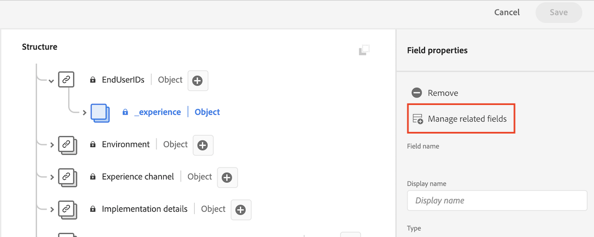
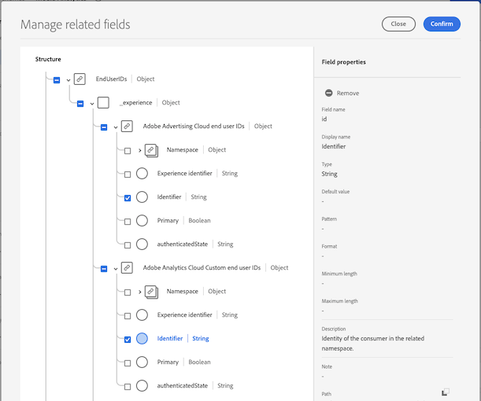
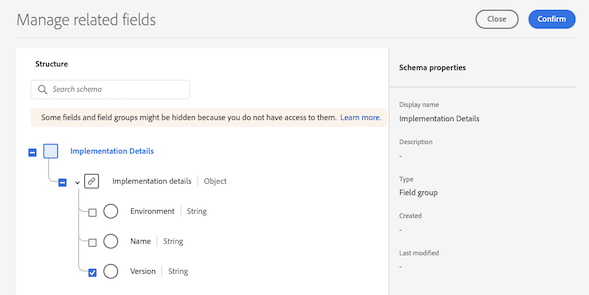
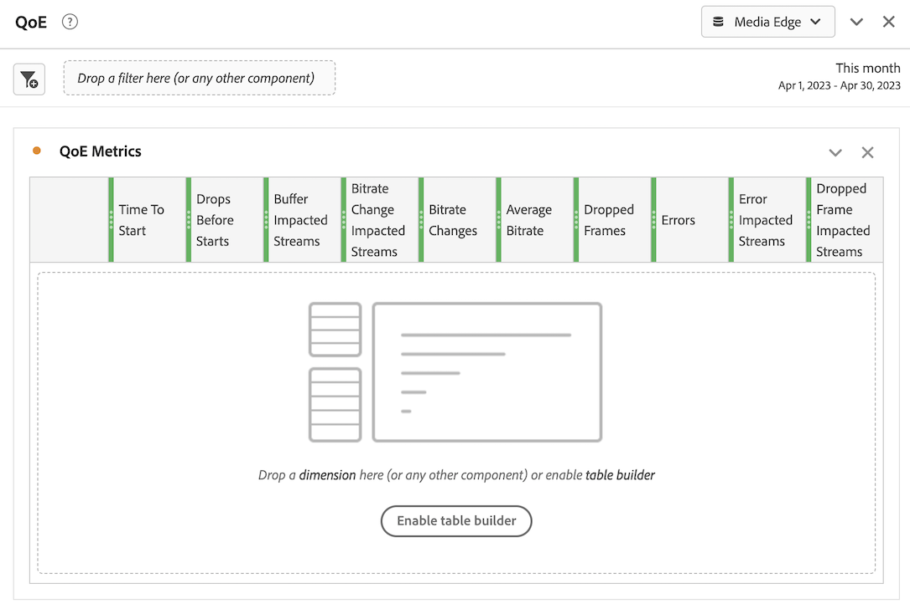

# Install Analytics with Adobe Experience Platform Edge

{{release-limited-testing}}

Adobe Experience Platform Edge allows you to send data destined to multiple products to a centralized location. Experience Edge forwards the appropriate information to the desired products. This concept allows you to consolidate implementation efforts, especially spanning multiple data solutions.

You can send data to Experience Edge using any of the following implementation methods:

* Adobe Experience Platform Web SDK (Coming soon)
* Adobe Experience Platform Mobile SDK
* Edge Network Server API

Regardless of which Experience Edge implementation method you use, you must first complete the following sections:

* [Set up the schema in Adobe Experience Platform](#set-up-the-schema-in-adobe-experience-platform)
* [Create a dataset in Adobe Experience Platform](#create-a-dataset-in-adobe-experience-platform)
* [Create a connection in Customer Journey Analytics](#create-a-connection-in-customer-journey-analytics)
* [Create a data view in Customer Journey Analytics](#create-a-data-view-in-customer-journey-analytics)
* [Create and configure a project in Customer Journey Analytics](#create-and-configure-a-project-in-customer-journey-analytics)

## Set up the schema in Adobe Experience Platform 

To standardize data collection for use across applications that leverage Adobe Experience Platform, Adobe has created the open and publicly documented standard, Experience Data Model (XDM)

To create and set up a schema:

1. In Adobe Experience Platform, begin creating the schema as described in [Create and edit schemas in the UI](https://experienceleague.adobe.com/docs/experience-platform/xdm/ui/resources/schemas.html?lang=en).

   When creating the schema, choose [!UICONTROL **XDM ExperienceEvent**] from the [!UICONTROL **Create schema**] drop-down menu.

1. In the [!UICONTROL **Composition**] area, in the [!UICONTROL **Field groups**] section, select [!UICONTROL **Add**], then search for and add the following new field groups to the schema:
   * `Adobe Analytics ExperienceEvent Template`
   * `Implementation Details`
   * `MediaAnalytics Interaction Details`

   After you add the field groups, they should display in the [!UICONTROL **Field groups**] section, as follows:

   

1. In the [!UICONTROL **Structure**] area, select the `endUserIds` > `_experience` field group, then select [!UICONTROL **Manage related fields**].

   

1. Update the schema as follows:

   * In the `endUserIds` > `_experience` > `Adobe Advertising Cloud end user IDs` field group, hide all fields except the `Identifier` field.

   * In the `endUserIds` > `_experience` > `Adobe Analytics Cloud Custom end user IDs` field group, hide all fields except the `Identifier` field.

       

1. Select [!UICONTROL **Confirm**] to save your changes.

1. In the [!UICONTROL **Structure**] area, select the `Implementation Details` field group, select [!UICONTROL **Manage related fields**], then update the schema as follows:

   * In the `Implementation Details` > `Implementation details` field group, hide all fields except for `version`.

     

1. Select [!UICONTROL **Confirm**] to save your changes.

1. In the [!UICONTROL **Structure**] area, select the `Media Collection Details` field group, select [!UICONTROL **Manage related fields**], then update the schema as follows:

   * In the `Media Collection Details` field group, hide the `List Of States` field group.

     

   * In the `Media Collection Details` > `Advertising Details` field group, hide the frollowing reporting fields: `Ad Completed`, `Ad Started`, and `Ad Time Played`.

   * In the `Media Collection Details` > `Advertising Pod Details` field group, hide the following reporting field: `Ad Break ID`

   * In the `Media Collection Details` > `Chapter Details` field group, hide the following reporting fields: `Chapter ID`, `Chapter Completed`, `Chapter Started`, and `Chapter Time Played`.

   * In the `Media Collection Details` > `Qoe Data Details` field group, hide the following reporting fields: `Average Bitrate`, `Average Bitrate Bucket`, `Bitrate Changes`, `Buffer Events`, `Total Buffer Duration`, `Errors`, `External Error IDs`, `Bitrate Change Impacted Streams`, `Buffer Impacted Streams`, `Dropped Frame Impacted Streams`, `Error Impacted Streams`, `Stalling Impacted Streams`, `Drops Before Starts`, `Media SDK Error IDs`, `Player SDK Error IDs`, `Stalling Events`, and `Total Stalling Duration`.

   * In the `Media Collection Details` > `Session Details` field group, hide the following reporting fields: `Media Session ID`, `Ad Count`, `Average Minute Audience`, `Chapter Count`, `Estimated Streams`, `Pause Impacted Streams`, `10% Progress Marker`, `25% Progress Marker`, `50% Progress Marker`, `75% Progress Marker`, `95% Progress Marker`, `Media Segment Views`, `Content Completes`, `Media Downloaded Flag`, `Federated Data`, `Content Starts`, `Media Starts`, `Pause Events`, `Total Pause Duration`, `Media Session Server Timeout`, `Video Segment`, `Content Time Spent`, `Media Time Spent`, `Unique Time Played`, `Pev3`, and `Pccr`.

   * In the `Media Collection Details` > `List Of States End` and `Media Collection Details` > `List Of States Start` field groups, hide the following reporting fields: `Player State Count`, `Player State Set`, and `Player State Time`.
      
      

1. Select [!UICONTROL **Confirm**] to save your changes.

1. In the [!UICONTROL **Structure**] area, select the `List Of Media Collection Downloaded Content Events` field group, select [!UICONTROL **Manage related fields**], then update the schema as follows:

   * In the `List Of Media Collection Downloaded Content Events` > `Media Details` field group, hide the `List Of States` field group.

   * In the `List Of Media Collection Downloaded Content Events` > `Media Details` > `Advertising Details` field group, hide the frollowing reporting fields: `Ad Completed`, `Ad Started`, and `Ad Time Played`.

   * In the `List Of Media Collection Downloaded Content Events` > `Media Details` > `Advertising Pod Details` field group, hide the following reporting field: `Ad Break ID`

   * In the `List Of Media Collection Downloaded Content Events` > `Media Details` > `Chapter Details` field group, hide the following reporting fields: `Chapter ID`, `Chapter Completed`, `Chapter Started`, and `Chapter Time Played`.

   * In the `List Of Media Collection Downloaded Content Events` > `Media Details` > `Qoe Data Details` field group, hide the following reporting fields: `Average Bitrate`, `Average Bitrate Bucket`, `Bitrate Changes`, `Buffer Events`, `Total Buffer Duration`, `Errors`, `External Error IDs`, `Bitrate Change Impacted Streams`, `Buffer Impacted Streams`, `Dropped Frame Impacted Streams`, `Error Impacted Streams`, `Stalling Impacted Streams`, `Drops Before Starts`, `Media SDK Error IDs`, `Player SDK Error IDs`, `Stalling Events`, and `Total Stalling Duration`.

   * In the `List Of Media Collection Downloaded Content Events` > `Media Details` > `Session Details` field group, hide the following reporting fields: `Media Session ID`, `Ad Count`, `Average Minute Audience`, `Chapter Count`, `Estimated Streams`, `Pause Impacted Streams`, `10% Progress Marker`, `25% Progress Marker`, `50% Progress Marker`, `75% Progress Marker`, `95% Progress Marker`, `Media Segment Views`, `Content Completes`, `Media Downloaded Flag`, `Federated Data`, `Content Starts`, `Media Starts`, `Pause Events`, `Total Pause Duration`, `Media Session Server Timeout`, `Video Segment`, `Content Time Spent`, `Media Time Spent`, `Unique Time Played`, `Pev3`, and `Pccr`.

   * In the `List Of Media Collection Downloaded Content Events` > `Media Details` > `List Of States End` and `Media Collection Details` > `List Of States Start` field groups, hide the following reporting fields: `Player State Count`, `Player State Set`, and `Player State Time`.

   * In the `List Of Media Collection Downloaded Content Events` > `Media Details`  field group, hide the `Media Session ID` field.

1. Select [!UICONTROL **Confirm**] to save your changes.

1. In the [!UICONTROL **Structure**] area, select the `Media Reporting Details` field group, select [!UICONTROL **Manage related fields**], then update the schema as follows:

   * In the `Media Reporting Details` field group, hide the following field groups: `Error Details`, `List Of States End`, `List of States Start`, `Playhead`, and `Media Session ID`.

1. Select [!UICONTROL **Confirm**] > [!UICONTROL **Save**]  to save your changes.

1. Continue with [Create a dataset in Adobe Experience Platform](#create-a-dataset-in-adobe-experience-platform).

## Create a dataset in Adobe Experience Platform

1. Ensure that you set up a schema as described in [Set up the Schema in Adobe Experience Platform](#set-up-the-schema-in-adobe-experience-platform).

1. In Adobe Experience Platform, begin creating the dataset as described in [Datasets UI guide](https://experienceleague.adobe.com/docs/experience-platform/catalog/datasets/user-guide.html?lang=en#create).

   When selecting a schema for your dataset, choose the schema that you previously created, as described in [Set up the Schema in Adobe Experience Platform](#set-up-the-schema-in-adobe-experience-platform).

1. Continue with [Create a connection in Customer Journey Analytics](#create-a-connection-in-customer-journey-analytics).

## Create a connection in Customer Journey Analytics

1. Ensure that you created a dataset as described in [Create a dataset in Adobe Experience Platform](#create-a-dataset-in-adobe-experience-platform).

1. In Customer Journey Analytics, create a connection as described in [Create a connection](https://experienceleague.adobe.com/docs/analytics-platform/using/cja-connections/create-connection.html?lang=en).

   When creating the connection, the following configuration selections are required for implementing Media Analytics with Experience Platform Edge:

   1. Select the dataset that you previously created, as described in [Create a dataset in Adobe Experience Platform](#create-a-dataset-in-adobe-experience-platform).

   1. Ensure that the [!UICONTROL **Import all new data**] setting is enabled.

1. Continue with [Create a data view in Customer Journey Analytics](#create-a-new-data-view-in-customer-journey-analytics).

## Create a data view in Customer Journey Analytics

1. Ensure that you created a connection in Customer Journey Analytics as described in [Create a connection in Customer Journey Analytics](#create-a-connection-in-customer-journey-analytics).

1. In Customer Journey Analtyics, create a data view as described in [Create or edit a data view](https://experienceleague.adobe.com/docs/analytics-platform/using/cja-dataviews/create-dataview.html?lang=en).

   When creating the data view, the following configuration selections are required for implementing Media Analytics with Experience Platform Edge:

   1. In the [!UICONTROL **Connection**] field, select the connection that you previously created, as described in [Create a connection in Customer Journey Analytics](#create-a-connection-in-customer-journey-analytics).

      It can take up to 15 minutes before the connection that you created is available.

   1. On the [!UICONTROL **Components**] tab, in the [!UICONTROL **Schema fields**] section, search for each XDM path in the tables below and drag it into the Metrics panel. 
   
   1. In the [!UICONTROL **Component name**] field, change the name of each XDM path to the component name listed in the tables below.

      **Main content - Content metrics**
     
      |XDM path | Component name | 
      |---------|----------|
      | mediaReporting.sessionDetails.isViewed | Media Starts | 
      | mediaReporting.sessionDetails.hasSegmentView | Media Segment Views | 
      | mediaReporting.sessionDetails.isPlayed | Content Starts | 
      | mediaReporting.sessionDetails.isCompleted | Content Completes |
      | mediaReporting.sessionDetails.timePlayed | Content Time Spent |
      | mediaReporting.sessionDetails.totalTimePlayed | Media Time Spent |
      | mediaReporting.sessionDetails.uniqueTimePlayed | Unique Time Played |
      | mediaReporting.sessionDetails.hasProgress10 | 10% Progress Marker |
      | mediaReporting.sessionDetails.averageMinuteAudience | Average Minute Audience |
      
      **Chapter & Ads - Chapter & Ads metrics**

      |XDM path | Component name | 
      |---------|----------|
      | mediaReporting.chapterDetails.isStarted | Chapter Started | 
      | mediaReporting.chapterDetails.isCompleted | Chapter Completed |
      | mediaReporting.chapterDetails.timePlayed | Chapter Time Played |
      | mediaReporting.advertisingDetails.isStarted | Ad Started |
      | mediaReporting.advertisingDetails.isCompleted | Ad Completed |
      | mediaReporting.advertisingDetails.timePlayed | Ad Time Played |

      **QoE - QoE metrics**

      |XDM path | Component name | 
      |---------|----------|
      | mediaReporting.qoeDataDetails.timeToStart | Time To Start | 
      | mediaReporting.qoeDataDetails.isDroppedBeforeStart | Drops Before Starts |
      | mediaReporting.qoeDataDetails.hasBufferImpactedStreams | Buffer Impacted Streams |
      | mediaReporting.qoeDataDetails.hasBitrateChangeImpactedStreams | Bitrate Change Impacted Streams |
      | mediaReporting.qoeDataDetails.bitrateChangeCount | Bitrate Changes |
      | mediaReporting.qoeDataDetails.bitrateAverage | Average Bitrate |
      | mediaReporting.qoeDataDetails.droppedFrames | Dropped Frames |
      | mediaReporting.qoeDataDetails.errorCount | Errors |
      | mediaReporting.qoeDataDetails.hasErrorImpactedStreams | Error Impacted Streams |
      | mediaReporting.qoeDataDetails.hasDroppedFrameImpactedStreams | Dropped Frame Impacted Streams |

      **Player state - Player state metrics**

      |XDM path | Component name | 
      |---------|----------|
      | mediaReporting.states.isSet | Player State Set | 
      | mediaReporting.states.count | Player State Count |
      | mediaReporting.states.time | Player State Time |

   1. Update the labels (in the [!UICONTROL **Context labels**] drop-down menu) for the components in the following table. Search for and drag any components that are not already in the metrics panel into the panel.

      | Component name | Context label | 
      |---------|----------|
      | Media Session Server Timeout | Media: Seconds Since Last Call | 
      | Media Time Spent | Media: Media Time Spent |
      | Total Buffer Duration | Media: Total Buffer Duration |
      | Time to Start | Media: Time To Start |
      | Total Pause Duration | Media: Total Pause Duration |

   1. To add breakdowns to your Customer Journey Analytics project, add the following dimensions to the [!UICONTROL **Dimensions**] panel:
      
      |XDM path | Component name | 
      |---------|----------|
      | mediaReporting.states.name | Player State Name | 
      | mediaReporting.sessionDetails.ID | Media Session ID |

1. Select [!UICONTROL **Save and continue**] > [!UICONTROL **Save and finish**] to save your changes.

1. Continue with [Create and configure a project in Customer Journey Analytics](#create-and-configure-a-project-in-customer-journey-analytics).

## Create and configure a project in Customer Journey Analytics

1. In Customer Journey Analytics, in the [!UICONTROL **Workspace**] tab, in the [!UICONTROL **Projects**] area, select [!UICONTROL **Create project**].

1. Select [!UICONTROL **Blank project**] > [!UICONTROL **Create**].

1. In the new project, select the data view that you previously created, then create the following 4 panels, each containing the components listed in the tables from [Create a data view in Customer Journey Analytics](#create-a-new-data-view-in-customer-journey-analytics).

   The 4 panels you create should look like this:

   

   

   

   

1. Select the **Panels** icon in the left rail, then drag in the following 2 additional panels:

   

   

1. Share the project as described in [Share projects](https://experienceleague.adobe.com/docs/analytics-platform/using/cja-workspace/curate-share/share-projects.html?lang=en).

   >[!NOTE]
   >
   >   If the users you want to share with are not available, make sure the users have user and admin access to Customer Journey Analytics in the Adobe Admin Console.

1. Continue with [Send data to Experience Platform Edge](#send-data-to-experience-platform-edge)

## Send data to Experience Platform Edge

You can send data to Experience Platform Edge using either of the following implementation methods:

+++Adobe Experience Platform Web SDK (Coming soon)

>[!NOTE]
>
>The Adobe Experience Platform Web SDK is not yet available. It will be made available at a future time.

<!-- Content initially copied from here: https://experienceleague.adobe.com/docs/analytics/implementation/aep-edge/web-sdk/overview.html?lang=en -->

Use the Web SDK extension in Adobe Experience Platform Data Collection to send data to Edge.

You can use the [Adobe Experience Platform Web SDK](https://experienceleague.adobe.com/docs/experience-platform/tags/extensions/client/sdk/overview.html) to send data to Adobe Analytics. This implementation method works by translating the [Experience Data Model (XDM)](https://experienceleague.adobe.com/docs/experience-platform/xdm/home.html) into a format used by Analytics.

You can send data to Experience Edge directly using the Web SDK, or through the Web SDK extension in Tags.

### Web SDK

A high-level overview of the implementation tasks:

<table style="width:100%">

<tr>
<th style="width:5%"></th><th style="width:60%"><b>Task</b></th><th style="width:35%"><b>More Information</b></th>
</tr>

<tr>
<td>1</td>
<td>Ensure you have <b>defined a report suite</b>.</td>
<td><a href="../../../admin/admin/c-manage-report-suites/report-suites-admin.md">Report Suite Manager</a></td>
</tr>

<tr>
<td>2</td>
<td><b>Setup schemas and datasets</b>. To standardize data collection for use across applications that leverage Adobe Experience Platform, Adobe has created the open and publicly documented standard, Experience Data Model (XDM).</td>
<td><a href="https://experienceleague.adobe.com/docs/experience-platform/xdm/ui/overview.html?lang=en">Schemas UI overview</a> and <a href="https://experienceleague.adobe.com/docs/experience-platform/catalog/datasets/user-guide.html?lang=en">Datasets UI overview</a></td>
</tr>

<tr>
<td>3</td>
<td><b>Create a data layer</b> to manage the tracking of the data on your website.</td>
<td><a href="../../prepare/data-layer.md">Create a data layer</a></td>
</tr>

<tr>
<td> 4</td>
<td><b>Install the prebuilt standalone version</b>. You can reference the library (<code>alloy.js</code>) on the CDN directly on your page or download and host it on your own infrastructure. Alternatively, you can use the NPM package.</td>
<td><a href="https://experienceleague.adobe.com/docs/experience-platform/edge/fundamentals/installing-the-sdk.html?lang=en#option-2%3A-installing-the-prebuilt-standalone-version">Installing the prebuilt standalone version</a> and <a href="https://experienceleague.adobe.com/docs/experience-platform/edge/fundamentals/installing-the-sdk.html?lang=en#option-3%3A-using-the-npm-package">Using the NPM package</a></td>
</tr>

<tr>
<td>5</td>
<td><b>Configure a datastream</b>. A datastream represents the server-side configuration when implementing the Adobe Experience Platform Web SDK.</td>
<td><a href="https://experienceleague.adobe.com/docs/experience-platform/edge/datastreams/configure.html?lang=en">Configure a datastream<a></td> 
</tr>

<td>6</td>
<td><b>Add an Adobe Analytics service</b> to your datastream. That service controls whether and how data is sent to Adobe Analytics.</td>
<td><a href="https://experienceleague.adobe.com/docs/experience-platform/edge/datastreams/configure.html?lang=en#analytics">Add Adobe Analytics service to a datastream</a></td>
</tr>

<tr>
<td>7</td>
<td><b>Configure the Web SDK</b>. Ensure the library that you installed in step 4 is properly configured with the datastream ID (formerly known as edge configuration id (<code>edgeConfigId</code>)), organization id (<code>orgId</code>), and other available options.</td>
<td><a href="https://experienceleague.adobe.com/docs/experience-platform/edge/fundamentals/configuring-the-sdk.html?lang=en">Configure the Web SDK</a></td>
</tr>

<tr>
<td>8</td>
<td><b>Execute commands</b> and/or <b>track events</b>. After the base code has been implemented on your webpage, you can begin executing commands and tracking events with the SDK.
</td>
<td><a href="https://experienceleague.adobe.com/docs/experience-platform/edge/fundamentals/executing-commands.html?lang=en">Execute commands</a> and <a href="https://experienceleague.adobe.com/docs/experience-platform/edge/fundamentals/tracking-events.html?lang=en">Track events</a></td>
</tr>

<tr>
<td>9</td><td><b>Extend and validate your implementation</b> before pushing it out to production.</td><td></td> 
</tr>
</table>

### Web SDK extension

A high-level overview of the implementation tasks:

<table style="width:100%">

<tr>
<th style="width:5%"></th><th style="width:60%"><b>Task</b></th><th style="width:35%"><b>More Information</b></th>
</tr>

<tr>
<td>1</td>
<td>Ensure you have <b>defined a report suite</b>.</td>
<td><a href="../../../admin/admin/c-manage-report-suites/report-suites-admin.md">Report Suite Manager</a></td>
</tr>

<tr>
<td>2</td>
<td><b>Setup schemas and datasets</b>. To standardize data collection for use across applications that leverage Adobe Experience Platform, Adobe has created the open and publicly documented standard, Experience Data Model (XDM).</td>
<td><a href="https://experienceleague.adobe.com/docs/experience-platform/xdm/ui/overview.html?lang=en">Schemas UI overview</a> and <a href="https://experienceleague.adobe.com/docs/experience-platform/catalog/datasets/user-guide.html?lang=en">Datasets UI overview</a></td>
</tr>

<tr>
<td>3</td>
<td><b>Create a data layer</b> to manage the tracking of the data on your website.</td>
<td><a href="../../prepare/data-layer.md">Create a data layer</a></td>
</tr>

<tr>
<td>4</td>
<td><b>Configure a datastream</b>. A datastream represents the server-side configuration when implementing the Adobe Experience Platform Web SDK.</td>
<td><a href="https://experienceleague.adobe.com/docs/experience-platform/edge/datastreams/configure.html?lang=en">Configure a datastream<a></td> 
</tr>

<tr>
<td>5</td> 
<td><b>Add an Adobe Analytics service</b> to your datastream. That service controls whether and how data is sent to Adobe Analytics.</td>
<td><a href="https://experienceleague.adobe.com/docs/experience-platform/edge/datastreams/configure.html?lang=en#analytics">Add Adobe Analytics service to a datastream</a></td>
</tr>

<tr>
<td>6</td>
<td><b>Create a tag property</b>. Properties are overarching containers used to reference tag management data.</td>
<td><a href="https://experienceleague.adobe.com/docs/experience-platform/tags/admin/companies-and-properties.html?lang=en#for-web">Create or configure a tag property for web</a></td>
</tr>

<tr>
<td>7</td> 
<td><b>Install and configure the Web SDK extension</b> in your tag property. Configure the Web SDK extension to send data to the datastream configured in step 4.</td>
<td><a href="https://experienceleague.adobe.com/docs/experience-platform/tags/extensions/client/sdk/overview.html?lang=en">Adobe Experience Platform Web SDK extension overview</a></td>
</tr>

<tr>
<td>8</td>
<td><b>Iterate, validate, and publish</b> to production. Add the tag property to your web site. Then use data elements, rules, and so on, to customize your implementation.</td>
<td><a href="https://experienceleague.adobe.com/docs/experience-platform/tags/publish/overview.html?lang=en">Publishing overview</a></td>
</tr>

</table>

### Additional resources

Tags can be highly customized. Learn more about how you can get the most out of Adobe Analytics by including the right data in your implementation.

-   [Tags documentation](https://experienceleague.adobe.com/docs/experience-platform/tags/home.html#): Learn how the interface works and what extensions are available.

-   [Adobe Experience Platform Web SDK documentation](https://experienceleague.adobe.com/docs/web-sdk.html?lang=en)

+++

+++Adobe Experience Platform Mobile SDK

Use the Mobile SDK extension in Adobe Experience Platform Data Collection to send data to Edge.

<!-- Content initially copied from here: https://experienceleague.adobe.com/docs/analytics/implementation/aep-edge/mobile-sdk/overview.html?lang=en -->

The Adobe Experience Platform Mobile SDK helps power Adobe's Experience Cloud solutions and services in your mobile apps. It is available for Android&trade;, iOS, and various cross-platform development frameworks. Configuration is handled through Adobe Experience Platform Data Collection.
>[!IMPORTANT]
>
>An Adobe Analytics extension is also available in Adobe Experience Platform Data Collection. If you install this extension, you do not take advantage of XDM or the Edge Network.

### Adobe Experience Platform SDK

A high-level overview of the implementation tasks:

<table style="width:100%">

<tr>
<th style="width:5%"></th><th style="width:60%"><b>Task</b></th><th style="width:35%"><b>More Information</b></th>
</tr>

<tr>
<td>1</td>
<td>Ensure you have <b>defined a report suite</b>.</td>
<td><a href="../../../admin/admin/c-manage-report-suites/report-suites-admin.md">Report Suite Manager</a></td>
</tr>

<tr>
<td>2</td>
<td><b>Setup schemas and datasets</b>. To standardize data collection for use across applications that leverage Adobe Experience Platform, Adobe has created the open and publicly documented standard, Experience Data Model (XDM).</td>
<td><a href="https://experienceleague.adobe.com/docs/experience-platform/xdm/ui/overview.html?lang=en">Schemas UI overview</a> and <a href="https://experienceleague.adobe.com/docs/experience-platform/catalog/datasets/user-guide.html?lang=en">Datasets UI overview</a></td>
</tr>

<tr>
<td>3</td>
<td><b>Configure a datastream</b>. A datastream represents the server-side configuration when implementing the Adobe Experience Platform Web SDK.</td>
<td><a href="https://experienceleague.adobe.com/docs/experience-platform/edge/datastreams/configure.html?lang=en">Configure a datastream<a></td> 
</tr>

<td>4</td>
<td><b>Add an Adobe Analytics service</b> to your datastream. That service controls whether and how data is sent to Adobe Analytics.</td>
<td><a href="https://experienceleague.adobe.com/docs/experience-platform/edge/datastreams/configure.html?lang=en#analytics">Add Adobe Analytics service to a datastream</a></td>
</tr>

<tr>
<td>5</td>
<td><b>Create a mobile property</b>. A property is a container that you fill with extensions, rules, data elements, and libraries.</td>
<td><a href="https://developer.adobe.com/client-sdks/documentation/getting-started/create-a-mobile-property/">Set up a mobile property</a></tr>

<tr>
<td>6</td>
<td><b>Install the Adobe Experience Platform Edge Network extension</b> in the mobile tag property and configure the datastream in the extension.</td>
<td><a href="https://developer.adobe.com/client-sdks/documentation/edge-network/">Adobe Experience Platform Edge Network</a>
</tr>

<tr>
<td>7</td>
<td><b>Use code in your app</b> to register the necessary extensions and load your tag configuration.</td>
<td><a href="https://developer.adobe.com/client-sdks/documentation/user-guides/getting-started-with-platform/overview/#set-up-the-configuration">Set up the configuration</a></td>
</tr>

<tr>
<td>8</td>
<td><b>Implement and test functionality</b> using combination of tag's data elements, rules, additional extensions, and SDK API calls in your app. Inspect, validate, and debug data collection and experiences for your mobile application.</td>
<td><a href="https://developer.adobe.com/client-sdks/documentation/user-guides/getting-started-with-platform/overview/#use-the-sample-application">Use the sample application</a>
</tr>

<tr>
<td>9</td>
<td><b>Extend and validate your mobile app implementation</b> before pushing it out to production.</td>
<td></td> 
</tr>

</table>

### Adobe Analytics extension.

A high-level overview of the implementation tasks:

<table style="width:100%">

<tr>
<th style="width:5%"></th><th style="width:60%"><b>Task</b></th><th style="width:35%"><b>More Information</b></th>
</tr>

<tr>
<td>1</td>
<td>Ensure you have <b>defined a report suite</b>.</td>
<td><a href="../../../admin/admin/c-manage-report-suites/report-suites-admin.md">Report Suite Manager</a></td>
</tr>

<tr>
<td>2</td>
<td><b>Setup schemas and datasets</b>. To standardize data collection for use across applications that leverage Adobe Experience Platform, Adobe has created the open and publicly documented standard, Experience Data Model (XDM).</td>
<td><a href="https://experienceleague.adobe.com/docs/experience-platform/xdm/ui/overview.html?lang=en">Schemas UI overview</a> and <a href="https://experienceleague.adobe.com/docs/experience-platform/catalog/datasets/user-guide.html?lang=en">Datasets UI overview</a></td>
</tr>

<tr>
<td>3</td>
<td><b>Install the Adobe Analytics extension</b> in the mobile tag property and configure the extension to point to your report suite.</td>
<td><a href="https://developer.adobe.com/client-sdks/documentation/adobe-analytics/">Adobe Analytics extension for mobile property</a>
</tr>

<tr>
<td>4</td>
<td><b>Use code in your app</b> to register the necessary extensions and load your tag configuration.</td>
<td><a href="https://developer.adobe.com/client-sdks/documentation/user-guides/getting-started-with-platform/overview/#set-up-the-configuration">Set up the configuration</a></td>
</tr>

<tr>
<td>5</td>
<td><b>Implement and test functionality</b> using combination of tag's data elements, rules, additional extensions, and SDK API calls in your app. Inspect, validate, and debug data collection and experiences for your mobile application.</td>
<td><a href="https://developer.adobe.com/client-sdks/documentation/user-guides/getting-started-with-platform/overview/#use-the-sample-application">Use the sample application</a>
</tr>

<tr>
<td>6</td>
<td><b>Extend and validate your mobile app implementation</b> before pushing it out to production.</td>
<td></td> 
</tr>

</table>

### Additional resources

-   [Tags documentation](https://experienceleague.adobe.com/docs/experience-platform/tags/home.html#)

-   [Mobile SDK documentation](https://developer.adobe.com/client-sdks/documentation/)

+++

+++Edge Network Server API

Send data directly to Edge using an API.

<!-- Content initially copied from here: https://experienceleague.adobe.com/docs/analytics/implementation/aep-edge/edge-api/overview.html?lang=en -->

If you are unable to use the Adobe Experience Platform [Web SDK](../web-sdk/overview.md) or [Mobile SDK](../mobile-sdk/overview.md), you can send data to the Edge Network directly through an API.

See [Edge Network Server API documentation](https://experienceleague.adobe.com/docs/experience-platform/edge-network-server-api/overview.html), and an example [integrating with Adobe Analytics](https://experienceleague.adobe.com/docs/experience-platform/edge-network-server-api/interacting-other-adobe-solutions/interacting-adobe-analytics.html).

+++
