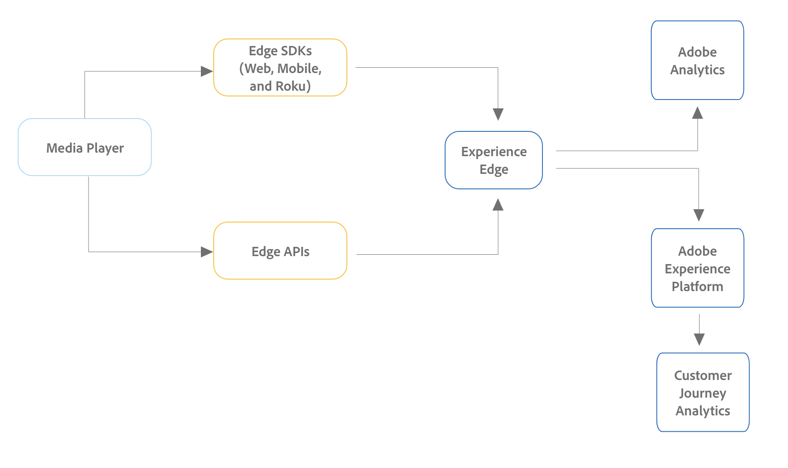

# Implement the Streaming Media Collection Add-on

There are various ways to implement the Adobe Streaming Media Collection Add-on. For a detailed comparison of supported devices and platforms for the implementation methods described on this page, see [Supported devices and platforms](/help/getting-started/supported-devices.md).

## Edge implementation methods

We recommend using Edge when implementing the Streaming Media Collection Add-on for all new Adobe Analytics or Customer Journey Analytics customers.

* **Media for Edge Network SDK / Extension:** Collects data from the web, iOS and Android devices, or Roku devices and sends it to Edge Network. Data can then be sent either to Customer Journey Analytics or Adobe Analytics. 

  For more information about the Media for Edge Network SDK / Extension, see [Implement the Streaming Media Collection Add-on using the Edge Network](/help/implementation/edge/implementation-edge.md).

* **Media Edge API:** Can be customized to collect data from any device or format (including, mobile, web, and over-the-top devices) and sends data to Edge Network. Data can then be sent either to Customer Journey Analytics or Adobe Analytics. 

  For more information about the Media Edge API, see [Media Edge API overview](https://developer.adobe.com/cja-apis/docs/endpoints/media-edge/).

## Adobe Analytics-only implementation methods

The Edge implementation methods described above are recommended for both Customer Journey Analytics and Adobe Analytics, especially for new implementations.

In addition to the Edge implementation methods, other implementation methods are available. These implementation methods were designed for use with Adobe Analytics. However, existing customers with any of the following implementation methods can still make data available in Customer Journey Analytics by creating an [Analytics source connection](https://experienceleague.adobe.com/docs/experience-platform/sources/ui-tutorials/create/adobe-applications/analytics.html).

* **Media Extension with tags:** The Adobe Media Analytics for Audio and Video extension provides the functionality for adding the Media tracker instance to a tags-enabled site or project. Data is sent to Adobe Analytics.

  For information on installing, configuring, and implementing the Media Extension with tags, see [Adobe Media Analytics (3.x SDK) for Audio and Video extension overview](https://experienceleague.adobe.com/docs/experience-platform/tags/extensions/client/media-analytics-3x/overview.html).

* **Media SDK:**  The Media SDK allows you to measure multiple media platforms, including websites, mobile phones, connected TVs, tablets, OTT devices, set-top boxes, and gaming consoles. (For more information, see [Supported devices and platforms](/help/getting-started/supported-devices.md).)

  The Media SDKs use the Media Collection APIs for tracking. Data is sent to Adobe Analytics.

  For information about downloading and installing Media SDKs and extensions, see [Get Media SDKs, Extensions using Tags, and OTT SDKs](/help/getting-started/download-sdks.md).

* **Media Collection APIs:** Because the Media Collection APIs are customizable, they can be used for applications that require custom tracking capabilities and for devices not supported by the Media SDKs. The Media Collection APIs track audio and video events using RESTful HTTP calls. Data is sent to Adobe Analytics.

  For information about using the Media Collection APIs, see [Media Collection APIs](media-collection-api/mc-api-overview.md).

<!--
(Not sure if we need the following paragraph and graphic. Paragraph is somewhat redundant with the intro paragraph of this article)
Choose the implementation method depending on the supported platforms. Some players are not supported by the Media SDKs or the Adobe Experience Platform Media Extensions. The Media Collection APIs provide a way to support those players. For information on supported devices, see [Supported devices and platforms](/help/getting-started/supported-devices.md).

-->
