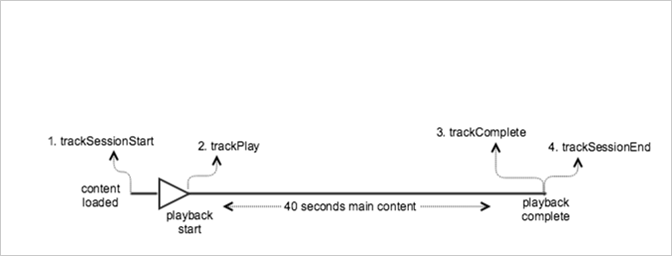

# Playback with no interruptions

<a id="fig_AB77956465F440B98D3990A56751F766"></a>  
To view this scenario in iOS, set up the following code: 
```
when the user clicks Play 
ADBMediaObject *mediaObject =  
  [ADBMediaHeartbeat createMediaObjectWithName:VIDEO_NAME  
                     length:VIDEO_LENGTH  
                     streamType:ADBMediaHeartbeatStreamTypeVOD]; 
  
NSMutableDictionary *videoContextData = [[NSMutableDictionary alloc] init]; 
[videoContextData setObject:CUSTOM_VAL_1 forKey:CUSTOM_KEY_1]; 
[videoContextData setObject:CUSTOM_VAL_2 forKey:CUSTOM_KEY_2]; 
  
// 1. Call trackSessionStart when the user clicks Play or if autoplay is used,  
//    i.e., there's an intent to start playback. 
[_mediaHeartbeat trackSessionStart:mediaObject data:videoContextData]; 
...... 
...... 
  
// 2. Call trackPlay when the playback actually starts, i.e., when the  
//    first frame of main content is rendered on the screen. 
[_mediaHeartbeat trackPlay]; 
....... 
....... 
  
// 3. Call trackComplete when the playback reaches the end, i.e.,  
//    when the video completes and finishes playing. 
[_mediaHeartbeat trackComplete]; 
........ 
........ 
  
// 4. Call trackSessionEnd when the playback session is over. This method  
//    must be called even if the user does not watch the video to completion. 
[_mediaHeartbeat trackSessionEnd]; 
........ 
........ 

```

