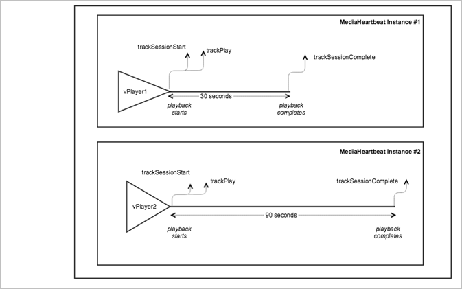

# Multiple trackers in parallel


><a id="fig_E333C95A544A4DCFB192F9DA9093BB04"></a>  
>
>```
>@interface VideoAnalyticsProvider : NSObject <ADBMediaHeartbeatDelegate> 
> 
>@end    
>  
>@implementation { 
>    VideoPlayer *_player; 
>} 
>  
>- (instancetype)initWithPlayer:(AVPlayer *)player { 
>    if (self = [super init]) { 
>        _player = player; 
>  
>        ADBMediaHeartbeatConfig *config =  
>          [[ADBMediaHeartbeatConfig alloc] init]; 
>        config.trackingServer = HEARTBEAT_TRACKING_SERVER; 
>        config.channel = HEARTBEAT_CHANNEL; 
>        config.appVersion = HEARTBEAT_SDK_VERSION; 
>        config.playerName = PLAYER_NAME; 
>        config.ssl = SSL_SETTING; 
>        config.debugLogging = DEBUG_SETTING; 
>  
>        ADBMediaHeartbeatConfig *config =  
>          [[ADBMediaHeartbeatConfig alloc] init];       
>        _mediaHeartbeat =  
>          [[ADBMediaHeartbeat alloc] initWithDelegate:self config:config]; 
>          
>        [self setupPlayerNotifications]; 
>    } 
>  
>    return self; 
>} 
>  
>- (ADBMediaObject *)getQoSInfo { 
>    return [ADBMediaHeartbeat createQoSObjectWithBitrate:CURRENT_BITRATE_VALUE  
>                              startupTime:CALCULATED_STARTED_TIME  
>                              fps:CALCULATED_FPS  
>                              droppedFrames:DROPPED_FRAMES_COUNT]; 
>} 
>  
>- (NSTimeInterval)getCurrentPlaybackTime { 
>    return CMTimeGetSeconds(_player.currentTime); 
>} 
>  
>@end 
> 
>- (void)viewDidAppear:(BOOL)animated { 
>    [super viewDidAppear:animated]; 
>    [ADBMobile setDebugLogging:YES]; 
>  
>    // Setup the first video player 
>    NSURL *streamUrl = [NSURL URLWithString:CONTENT_URL_1]; 
>  
>    if (!self.videoPlayer1) { 
>        self.videoPlayer1 = [[VideoPlayer alloc] initWithContentURL:streamUrl]; 
>        //setup player 
>    } 
>  
>    // Create the VideoAnalyticsProvider instance and attach it to the first  
>    // VideoPlayer instance. 
>    if (!self.videoAnalyticsProvider1) { 
>        self.videoAnalyticsProvider1 =  
>          [[VideoAnalyticsProvider alloc] initWithPlayerDelegate:self.videoPlayer1]; 
>    } 
>  
>    // Setup the second video player 
>    NSURL *streamUrl2 = [NSURL URLWithString:CONTENT_URL_2]; 
>  
>    if (!self.videoPlayer2) { 
>        self.videoPlayer2 = [[VideoPlayer alloc] initWithContentURL:streamUrl2]; 
>        //setup player 
>    } 
>  
>    // Create the VideoAnalyticsProvider instance and attach it to the second  
>    // VideoPlayer instance. 
>    if (!self.videoAnalyticsProvider2) { 
>        self.videoAnalyticsProvider2 =  
>          [[VideoAnalyticsProvider alloc] initWithPlayerDelegate:self.videoPlayer2]; 
>    } 
>} 
>
>```
>
>```
>- (void)viewDidAppear:(BOOL)animated { 
>    [super viewDidAppear:animated]; 
>    [ADBMobile setDebugLogging:YES]; 
>  
>    // Setup the first video player 
>    NSURL *streamUrl = [NSURL URLWithString:CONTENT_URL_1]; 
>  
>    if (!self.videoPlayer1) { 
>        self.videoPlayer1 = [[VideoPlayer alloc] initWithContentURL:streamUrl]; 
>        //setup player 
>    } 
>  
>    // Create the VideoAnalyticsProvider instance and attach it to the first  
>    // VideoPlayer instance. 
>    if (!self.videoAnalyticsProvider1) { 
>        self.videoAnalyticsProvider1 =  
>          [[VideoAnalyticsProvider alloc] initWithPlayerDelegate:self.videoPlayer1]; 
>    } 
>  
>    // Setup the second video player 
>    NSURL *streamUrl2 = [NSURL URLWithString:CONTENT_URL_2]; 
>  
>    if (!self.videoPlayer2) { 
>        self.videoPlayer2 = [[VideoPlayer alloc] initWithContentURL:streamUrl2]; 
>        //setup player 
>    } 
>  
>    // Create the VideoAnalyticsProvider instance and attach it to the second VideoPlayer instance. 
>    if (!self.videoAnalyticsProvider2) { 
>        self.videoAnalyticsProvider2 =  
>          [[VideoAnalyticsProvider alloc] initWithPlayerDelegate:self.videoPlayer2]; 
>    } 
>} 
>
>```

>Both instances of ` VideoAnalyticsProvider` and ` ADBMediaHeartbeat` track two separate sessions, each with its own unique session IDs. The two sessions in the Charles debugging tool or debug logs can be identified by using the session ID value. 
>To display this scenario in iOS, set up the following code: >
>```
>// Set up mediaObject 
>ADBMediaObject *mediaObject =  
>  [ADBMediaHeartbeat createMediaObjectWithName:VIDEO_NAME  
>                     length:VIDEO_LENGTH  
>                     streamType:ADBMediaHeartbeatStreamTypeVOD]; 
>    
>NSMutableDictionary *videoContextData = [[NSMutableDictionary alloc] init]; 
>[videoContextData setObject:CUSTOM_VAL_1 forKey:CUSTOM_KEY_1]; 
>[videoContextData setObject:CUSTOM_VAL_2 forKey:CUSTOM_KEY_2]; 
>   
>// 1. Call trackSessionStart when the user clicks Play or if autoplay is used,  
>//    i.e., there is an intent to start playback. 
>[_mediaHeartbeat trackSessionStart:mediaObject data:videoContextData]; 
>....... 
>....... 
>  
>// 2. Call trackPlay when the playback actually starts, i.e., when the first  
>//    frame of the main content is rendered on the screen. 
>[_mediaHeartbeat trackPlay]; 
>....... 
>....... 
>  
>// 3. Call trackComplete when the playback reaches the end, i.e., when the 
>//    video completes and finishes playing. 
>[_mediaHeartbeat trackComplete]; 
>....... 
>....... 
>   
>// 4. Call trackSessionEnd when the playback session is over. This method  
>//    must be called even if the user does not watch the video to completion. 
>[_mediaHeartbeat trackSessionEnd]; 
>....... 
>....... 
>
>```

