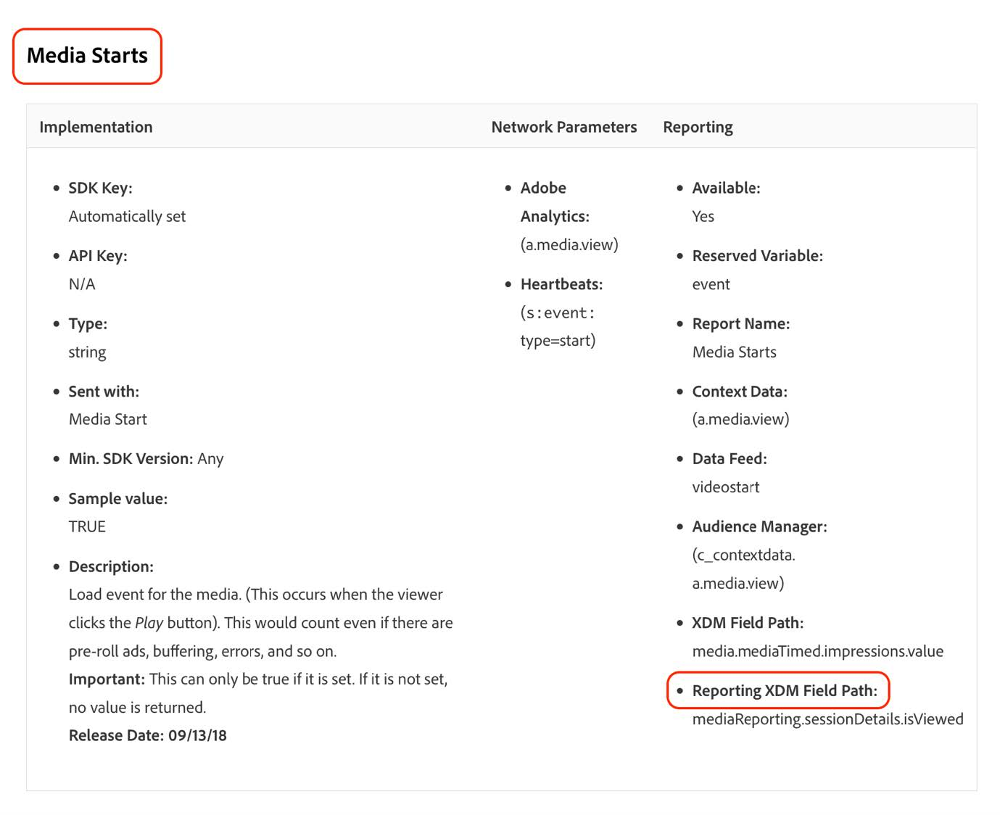

# Migrate audiences to the new Adobe Analytics for Streaming Media data type

This document describes how an audience using Adobe Analytics for Streaming Media fields from the deprecated "Media" data type (all fields for which path is starting with media.mediaTimed) should be migrated to use the new "[Media Reporting Details](https://experienceleague.adobe.com/en/docs/experience-platform/xdm/data-types/media-reporting-details)" data type.

## Migrate an audience

To migrate an audience from the old data type called "Media" to the new data type called "[Media Reporting Details](https://experienceleague.adobe.com/en/docs/experience-platform/xdm/data-types/media-reporting-details)" we will need to edit the audience and replace in every rule the old field from the deprecated data type with the new corresponding field from the new data type.

To migrate the audience to the new data type:

1. Locate rules containing fields from the deprecated "Media" data type – this will be all fields for which path is starting with media.mediaTimed

1. Duplicate those rules using fields from the new "[Media Reporting Details](https://experienceleague.adobe.com/en/docs/experience-platform/xdm/data-types/media-reporting-details)" data type

1. Keep both rules in place for a while to validate that the audiences are still working as expected

1. Remove the rules containing fields from the deprecated "Media" data type

1. Validate that the audiences are still working as expected

See the [Content ID](https://experienceleague.adobe.com/en/docs/media-analytics/using/implementation/variables/audio-video-parameters#content-id) parameter on the [Streaming Media parameters](https://experienceleague.adobe.com/en/docs/media-analytics/using/implementation/variables/audio-video-parameters) page to map between the old fields and the new fields. The old field path can be found under the "XDM Field Path" property while the new field path can be found under the "Reporting XDM Field Path" property.

## Example

To make it easier to follow the migration guidelines, consider the following example that contains an audience with a single rule. Because the audience has a single rule, we will need to apply the migration guidelines only once.

1. Select the [!UICONTROL **Edit audience**] button in the upper-right corner.

1. Locate the rules configured for the audience.

   

   

1. Select the rule to open its configuration.

   

1. (Optional) To view the path of the field used in the rule, select the info button near the field name.

   

1. Identify the field name (in this case "Media Starts") and check the mapping documentation from the old field to the new field here to find the corresponding path for the field under the new data type.

   

   

1. Add the exact same rule as the existing one using the new field.

   

   

   

1. Select [!UICONTROL **Save**] to save the audience. You can keep this setup for as long as you need in order to validate that the audience is still working as expected.

1. After the validation is complete, remove the old field, then select [!UICONTROL **Save**] to save the audience.

   

1. Validate the audience again.

   The audience migration process is complete.
