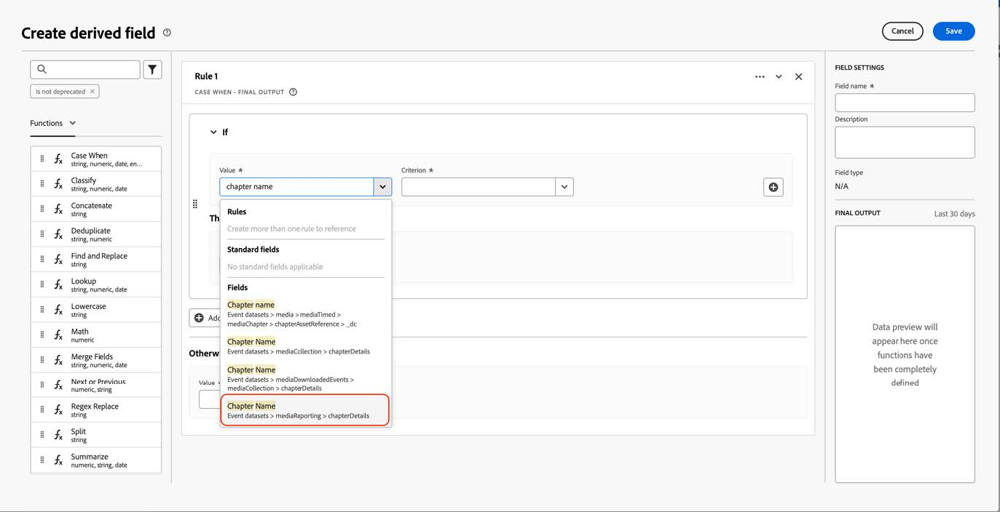

# Migrate Customer Journey Analytics to use the new Streaming Media fields

This document describes how a Customer Journey Analytics setup that uses the Adobe Streaming Media Collection data type called "Media" should be updated to use the new corresponding data type called "[Media Reporting Details](https://experienceleague.adobe.com/en/docs/experience-platform/xdm/data-types/media-reporting-details)."

## Migrate Customer Journey Analytics 

To migrate a Customer Journey Analytics setup from the old data type called "Media" to the new data type called "[Media Reporting Details](https://experienceleague.adobe.com/en/docs/experience-platform/xdm/data-types/media-reporting-details)," you must update the following setups that are using the old data type:

* Data views

* Derived fields

### Migrate data views

To migrate the data views to the new data type:

1. Locate all the data views using the deprecated "Media" data type. This is all fields for which the path begins with `media.mediaTimed`.

1. Do either of the following:

   * In those data views, insert the fields from the new "Media Reporting Details" data type. 

   * Create a derived field that uses the new "Media Reporting Details" data type if it is set, or that falls back to the old "Media" data type if the "Media Reporting Details" data type is not set.

### Migrate derived fields

To migrate derived fields to the new data type:

1. Locate all the derived fields using the deprecated "Media" data type. This is all derived fields that contain fields for which the path begins with `media.mediaTimed`.

1. Replace all the old fields in the derived field with the new corresponding field from "Media Reporting Details."

See the [Content ID](https://experienceleague.adobe.com/en/docs/media-analytics/using/implementation/variables/audio-video-parameters#content-id) parameter on the [Audio and video parameters](https://experienceleague.adobe.com/en/docs/media-analytics/using/implementation/variables/audio-video-parameters) page to map between the old fields and the new fields. The old field path is found under the "XDM Field Path" property while the new field path is found under the "Reporting XDM Field Path" property.

## Example

To make it easier to follow the migration guidelines, consider the following example that contains a data view with fields from the old deprecated "Media" data type. In this data view, you need to add the new corresponding fields. 

### Update the data view

You can use either of the following options to update the data view:

#### Option 1

1. Locate a metric or a dimension that is using the old field from the deprecated data type.

   

1. Check the corresponding new field in the [Chapter offset](https://experienceleague.adobe.com/en/docs/media-analytics/using/implementation/variables/chapter-parameters#chapter-offset) section in the [Chapter parameters](https://experienceleague.adobe.com/en/docs/media-analytics/using/implementation/variables/chapter-parameters) article.

1. Locate the new corresponding field in the data view.

   

1. Drag the new field to the metric or dimension.

1. Repeat this process for all metrics and dimensions that use fields from the deprecated "Media" data type.

#### Option 2

This option creates a derived field that selects the value from the old field or the value from the new field based on which one exists for a specific event. This derived field replaces the old "Media" data type in any projects where it is being used.

If you want to create a derived field for the "Chapter Name" that uses the new "Media Reporting Details" data type if it is set, or that falls back to the old "Media" data type if the "Media Reporting Details" data type is not set:

1. Drag a "Case When" clause into the derived fields.

   

1. Populate the [!UICONTROL **If**] clause using the value of the **Reporting XDM Field Path**, as shown in the [Chapter name](https://experienceleague.adobe.com/en/docs/media-analytics/using/implementation/variables/chapter-parameters#chapter-name) parameter on the [Chapter parameters](https://experienceleague.adobe.com/en/docs/media-analytics/using/implementation/variables/chapter-parameters) page.

   

   

   

   

1. Populate the fallback value using the old field from the deprecated "Media" data type.

   

   

   This is the final definition of the derived field.

   

1. To update the derived fields, locate a derived field that is using the old deprecated fields (path starting with `media.mediaTimed`).

   

1. Mouse over the derived field that you want to update, then select the [!UICONTROL **Edit**] icon.

1. Locate all the fields from the old data type (path starting with `media.mediaTimed`) and replace them with the new corresponding field.

   

1. Check the corresponding new field in the [Content Name (variable)](https://experienceleague.adobe.com/en/docs/media-analytics/using/implementation/variables/audio-video-parameters#content-name-variable) section in the [Streaming Media parameters](https://experienceleague.adobe.com/en/docs/media-analytics/using/implementation/variables/audio-video-parameters#content-name-variable) article.

1. Replace the old field with the new field.

   

1. Repeat this process for all the derived fields using fields from the old deprecated "Media" data type.

   The migration of the CJA setup is completed.
