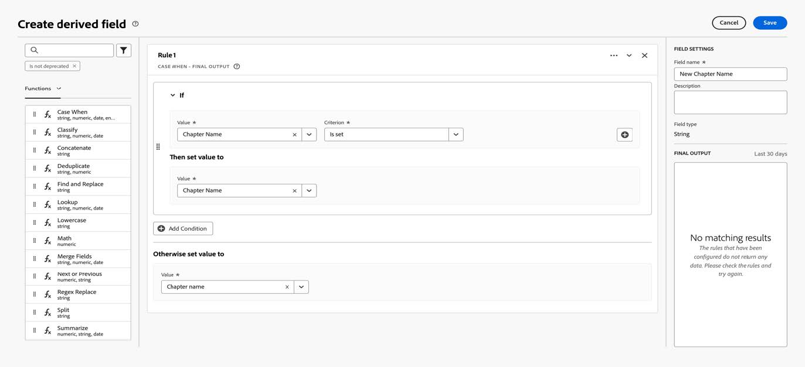

# Migrate Customer Journey Analytics to use the new Adobe Analytics for Streaming Media data type

This document describes how Customer Journey Analytics(CJA) setup using the Adobe Analytics for Streaming Media old data type called "Media" should be updated to use the new corresponding data type called "[Media Reporting Details](https://experienceleague.adobe.com/en/docs/experience-platform/xdm/data-types/media-reporting-details)".

## Migrate Customer Journey Analytics 

To migrate a Customer Journey Analytics setup from the old data type called "Media" to the new data type called "[Media Reporting Details](https://experienceleague.adobe.com/en/docs/experience-platform/xdm/data-types/media-reporting-details)" we will need to update the following setups that are using the old data type:

* Data views

* Derived fields

To migrate the data views to the new data type:

1. Locate all the data views using deprecated "Media" data type – this will be all fields for which path is starting with media.mediaTimed

* Option 1: In those data views insert the fields from the new data type "Media Reporting Details"

* Option 2: Create a derived field that will use the new field from "Media Reporting Details" if this is set or fallback to the old field from "Media" data type otherwise
The migration steps for the derived fields will be the following:

* Locate all the derived fields using deprecated "Media" data type - this will be all derived fields containing fields for which path is starting with media.mediaTimed

* Replace all the old fields in the derived field with the new corresponding field from "Media Reporting Details"

Mapping between the old fields and the new fields can be found here. More precisely, the old field path can be found under the "XDM Field Path" property while the new field path can be found under the "Reporting XDM Field Path".

## Hands-On example

Let's take an example to make it easier to follow the migration guidelines.
We have a data view containing fields from the old deprecated "Media" data type and we will add the new corresponding fields.
1.
Let's update the data view first.
*
Option 1
Locate a metric or a dimension that is using the old field from the deprecated data type.

Check the corresponding new field in the [Chapter offset](https://experienceleague.adobe.com/en/docs/media-analytics/using/implementation/variables/chapter-parameters#chapter-offset) section in the [Chapter parameters](https://experienceleague.adobe.com/en/docs/media-analytics/using/implementation/variables/chapter-parameters) article.

Locate the new corresponding field in the data view.

Drag and drop the new field.
Do the same for all metrics and dimensions using fields from deprecated "Media" data type.
*
Option 2
The second option will be to create a derived field that will select the value from the old field or the value from the new field based on which one exists for a specific event and use the derived field in the projects instead of the old field from the deprecated "Media" data type.
Let's take an example. Let's presume that we want to create a derived field for the "Chapter Name" that will use the new field if it is set or fallback to the old one if it is not set.
First step will be to drag and drop a "Case When" clause in the derive fields adding UI.

First, we populate the if clause using the new fields corresponding for "Chapter name".

And then we populate the fallback value using the old field from the deprecated "Media" data type.

And this will be the final definition of the derived field.

1. Now let's update the derived fields as well.
First locate a derived field that is using the old deprecated fields (path starting with media.mediaTimed).

Mouse over the drived field that you want to update, then select the Edit icon.

Locate all the fields from the old data type (path starting with media.mediaTimed) and replace them with the new corresponding field.

Check the corresponding new field in the [Content Name (variable)](https://experienceleague.adobe.com/en/docs/media-analytics/using/implementation/variables/audio-video-parameters#content-name-variable) section in the [Streaming Media parameters](https://experienceleague.adobe.com/en/docs/media-analytics/using/implementation/variables/audio-video-parameters#content-name-variable) article.

Replace it with the new field.

Do the same for all the fields used in the derived field.

Repeat the above process for all the derived fields using fields from the old deprecated "Media" data type.

At this point the migration of the CJA setup is completed.

